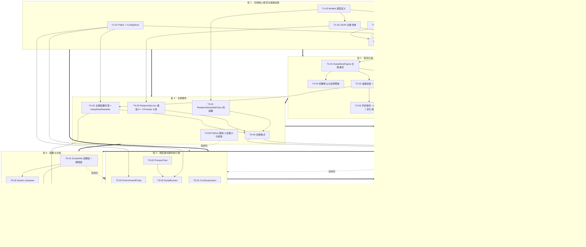

# CtYun-KeepAlive-Web 整合架构设计（ARCHITECTURE）

| 项目 | 内容 |
| --- | --- |
| 文档类型 | 系统架构设计 + 任务分解 |
| 项目名 | `ctyun_keepalive_web_integration` |
| 宿主项目 | `CtYun-KeepAlive-Web`（.NET 8 / `Microsoft.NET.Sdk.Web` / `PublishAot=true` / v1.1.5） |
| 上游输入 | `docs/PRD.md`（许清楚） + 团队拍板结论 Q1–Q8 |
| 架构师 | 高见远（Gao） |
| 版本 | v1.0 |
| 语言 | 简体中文 |

> **阅读顺序建议**：工程师按 §11 任务列表执行；执行前必读 §9 共享约定、§4 数据结构、§5 注册清单。
> 本文所有代码均为**设计意图的精确表达**，可直接誊写；遇到与本文冲突的实现细节，以本文为准并向架构师反馈。

---

## 〇、调研结论摘要（与 PRD 的差异，请先看这一节）

我在动手设计前完整通读了宿主源码与两个 Python 脚本，发现 **5 处与 PRD 假设不一致的事实**，它们直接改变了设计。团队请先确认这 5 点：

| # | 发现 | 对设计的影响 | 处置 |
| --- | --- | --- | --- |
| **F-1** | 仓库根已有**空目录** `Services/`，但 csproj 位于 `CtYun/CtYun.csproj`。`Microsoft.NET.Sdk.Web` 的 glob 只收集**项目目录内**的 `**/*.cs`。PRD 写的 `Services/CronScheduler.cs`（仓库根）**不会被编译**。 | 服务层必须放 `CtYun/Services/` | 全部服务落 `CtYun/Services/`、`CtYun/Models/`、`CtYun/Endpoints/`。仓库根 `Services/` 空目录**删除** |
| **F-2** | `pc_hang_task.py:88-110` 的 `get_device_code()`：环境变量 `DEVICECODE` 为空 → 读 `/app/data/.devicecode_{user}` → **都没有才 `input()`**。**非 TTY 下 `input()` 抛 `EOFError`，脚本直接崩溃退出码 1** | 不注入 `DEVICECODE` 则挂机任务 100% 失败 | ScriptRunner 必须注入 `DEVICECODE=account.DeviceCode`，**同时**由 C# 预写 `{DataDir}/.devicecode_{user}`（双保险） |
| **F-3** | 两个脚本在非 TTY 下 Python 默认**块缓冲 stdout**（4–8 KB）。`pc_hang_task.py` 用 `print(f"\r...", end="")` 打进度，缓冲不刷 → Web 日志终端会**假死 80 分钟** | 实时日志回灌失效 | ScriptRunner 必须注入 `PYTHONUNBUFFERED=1`（外加 `PYTHONIOENCODING=utf-8`）。这一条是 PTS-02 能否达标的关键 |
| **F-4** | PRD WEB-02 要求配置落 `settings.json`，但 `adminPassword` 在 `accounts.json`。**两份配置文件 = 两个 BUG-01 同源风险面** | 增加出错概率，违反"零破坏性升级" | **有意识偏离 PRD**：设置项统一并入 `AppConfig`（`accounts.json`），**不引入 `settings.json`**。理由见 §2.2 |
| **F-5** | `Program.cs:41` `ActiveWorkers` 注释写"key by account name"，但 `AccountStatuses` 按 `User`；而 `account.Name` 在 `LoadRuntimeConfig()` 里被 `FirstNotEmpty(Name, User)` 兜底为 `User`。**新装用户的 Name 初始就等于 User**，改名后才分叉 | 改名后旧引用失效 | 引入 `AccountKey` 解析函数（§3.2），全部以 `User` 归一化值为主键 |

---

## 一、实现方案与关键决策

### 1.1 总体架构

保持宿主既有形态：**单进程 .NET 8 AOT Web 应用 = 保活客户端 + Web 控制台**。
新增能力全部以**进程内静态服务**形式接入，**不引入 DI 容器注册、不引入 `IHostedService`、不引入多进程守护**。

```
┌───────────────────────────────────────────────────────────────────────────┐
│                        单进程 CtYun.dll (.NET 8 AOT)                       │
├───────────────────────────────────────────────────────────────────────────┤
│  Web 层  Minimal API (Endpoints/*.cs)  →  wwwroot/index.html + app.js      │
├──────────────┬──────────────┬──────────────┬──────────────┬───────────────┤
│ KeepAlive    │ CronScheduler│ ScriptRunner │ RedeemService│EnvironmentProbe│
│ Engine       │ + CronExpr   │ + ProcessTree│ + Schedule   │               │
│ (保活内核)    │ JobService   │ (子进程/树)   │   Policy     │ (环境自检)     │
├──────────────┴──────────────┴──────────────┴──────────────┴───────────────┤
│  基础设施层：Paths / ConfigStore(原子写) / LogBroadcaster(多播) /           │
│              AdminSessionStore(带过期) / Utility / CtYunApi(签名)          │
├───────────────────────────────────────────────────────────────────────────┤
│  数据目录 CTYUN_DATA_DIR：accounts.json / jobs.json / jobs_history.json /  │
│                          redeem_config.json / ctyun_restart_at / devices/ │
└───────────────────────────────────────────────────────────────────────────┘
                                    │ fork（可选能力）
                                    ▼
                    python3 scripts/{ai_chat_task|pc_hang_task}.py
                                    └─ Chromium（全局单实例互斥）
```

### 1.2 🔑 关键决策一：**零 DI 注册**（AOT 风险规避）

**决策**：所有后台常驻逻辑（调度器、重启监视器）**不用 `builder.Services.AddHostedService<T>()`**，改为在 `Program.cs` 里显式启动：

```csharp
// Program.cs（app.RunAsync 之前）
_ = Task.Run(() => CronScheduler.RunAsync(GlobalState.GlobalCts.Token));
_ = Task.Run(() => KeepAliveRestarter.RunAsync(GlobalState.GlobalCts.Token));
_ = Task.Run(() => EnvironmentProbe.RunStartupCheckAsync(GlobalState.GlobalCts.Token));
```

**理由**（这是硬约束"本机无 SDK、无法编译"下的必然选择）：
- `AddHostedService<T>()` 内部走 `ActivatorUtilities`，依赖反射构造。虽然 .NET 8 的 trim 标注在无参公开构造时大概率能保留，但**我们无法编译验证**，任何 `IL2026/IL3050` 警告都只能在实机构建时才暴露。
- `_ = Task.Run(() => X.RunAsync(token))` 是纯静态方法调用，**AOT 分析器 100% 可静态追踪，零裁剪风险**。
- 代价：失去 DI 的生命周期管理。本应用场景下没有需要注入的依赖（全部静态/单例），代价为零。

**配套规则**：新增任何服务都写成 **`internal static class` + 静态方法**，或 **`internal sealed class` + 显式 `new`**。禁止 `Activator.CreateInstance`、`Assembly.Load`、`MakeGenericType`、`dynamic`。

### 1.3 🔑 关键决策二：账号主键统一（BUG-03）

**主键定义**：`AccountKey = account.User.Trim()`（手机号，唯一、不可变）。

**归一化函数**（`Services/AccountKey.cs`，纯函数，20 行）：

```csharp
internal static class AccountKey
{
    public static string Normalize(string user)
        => string.IsNullOrWhiteSpace(user) ? "" : user.Trim();

    /// 容错解析：接受 User 或 Name，返回主键；解析不到返回 null。
    public static string Resolve(string nameOrUser, List<AccountConfig> accounts)
    {
        if (string.IsNullOrWhiteSpace(nameOrUser)) return null;
        var input = nameOrUser.Trim();
        foreach (var a in accounts)
            if (string.Equals(Normalize(a.User), input, StringComparison.Ordinal)) return Normalize(a.User);
        foreach (var a in accounts)
            if (string.Equals((a.Name ?? "").Trim(), input, StringComparison.Ordinal)) return Normalize(a.User);
        return null;
    }
}
```

**贯穿规则**：
- `GlobalState.ActiveWorkers` / `AccountStatuses` / `PendingLogins` / `PendingConfigs`：**一律以 `AccountKey` 为键**。
- 所有 REST 端点入参 `{key}`：先 `AccountKey.Resolve()`，`null` 时返回 `WebResponseBase{ Success=false, Msg="未找到账号：xxx（如已修改别名，请使用手机号操作）" }`，**绝不静默失败**。
- `Name` 退化为纯展示。**改别名不影响运行中的保活**（`BUG-08` 验收点）：因为 worker 持有的是 `AccountConfig` 对象引用，只改 `Name` 属性即可，不重启会话。
- 删除账号 → 清理 `AccountStatuses[key]` + 禁用关联任务（PTS-05）+ 标记关联任务 UI 徽标。

### 1.4 🔑 关键决策三：日志多播（BUG-02）

**问题**：`Utility.LogChannel` 是单 Reader 的 `BoundedChannel`，多 SSE 连接互相抢。

**设计**（`Services/LogBroadcaster.cs` + `Models/LogModels.cs`）：

```csharp
internal enum LogLevel { Info = 0, Success = 1, Warn = 2, Error = 3 }

internal sealed class LogEntry
{
    [JsonPropertyName("ts")]     public long Ts { get; set; }      // Unix 毫秒
    [JsonPropertyName("level")]  public LogLevel Level { get; set; }
    [JsonPropertyName("source")] public string Source { get; set; } // "系统"/"账号名"/"AI对话"/"挂机"/"兑换"
    [JsonPropertyName("line")]   public string Line { get; set; }   // 完整格式化行，含 [HH:mm:ss.ff] 前缀
}

internal sealed class LogBroadcaster
{
    private readonly object _gate = new();
    private readonly LinkedList<LogEntry> _history = new();   // 环形历史缓冲
    private readonly Dictionary<long, Subscriber> _subs = new();
    private long _nextId;

    public const int DefaultHistorySize = 500;                 // 可由 AppConfig.LogHistorySize 覆盖
    private const int SubscriberQueueSize = 256;

    private sealed class Subscriber
    {
        public Channel<LogEntry> Channel = Channel.CreateBounded<LogEntry>(
            new BoundedChannelOptions(SubscriberQueueSize)
            { FullMode = BoundedChannelFullMode.DropOldest, SingleReader = true, SingleWriter = false });
    }

    public void Publish(LogLevel level, string source, string message)
    {
        var entry = new LogEntry { Ts = DateTimeOffset.Now.ToUnixTimeMilliseconds(), Level = level,
                                   Source = source ?? "系统", Line = FormatLine(level, source, message) };
        Subscriber[] snapshot;
        lock (_gate)
        {
            _history.AddLast(entry);
            while (_history.Count > _historyLimit) _history.RemoveFirst();
            snapshot = new Subscriber[_subs.Count];
            _subs.Values.CopyTo(snapshot, 0);
        }
        // 锁外投递：慢消费者绝不会持锁阻塞生产者
        foreach (var s in snapshot) s.Channel.Writer.TryWrite(entry);   // 只 TryWrite，永不 await
    }

    public (long Id, Channel<LogEntry> Channel, List<LogEntry> History) Subscribe() { /* lock 内生成 id、建订阅、拷历史 */ }
    public void Unsubscribe(long id) { lock (_gate) { if (_subs.Remove(id, out var s)) s.Channel.Writer.TryComplete(); } }
    public List<LogEntry> Snapshot() { lock (_gate) return new List<LogEntry>(_history); }
}
```

**慢消费者不拖垮生产者的保证**（三道）：
1. 生产者**只对快照数组做 `TryWrite`**，从不 `WriteAsync` / `await` → 不阻塞。
2. 每订阅者独立 `BoundedChannel(256) + DropOldest` → 慢消费者丢自己的旧日志，**不影响他人**。
3. 投递在 `lock` 外 → 持锁时间仅为"环形缓冲追加 + 数组拷贝"，O(订阅数) 且无 I/O。

**注销（防内存泄漏）**：SSE 端点用 `finally` 保证注销，并额外注册 `RequestAborted` 回调双保险：

```csharp
app.MapGet("/api/logs", async (HttpContext ctx) => {
    // ... 鉴权、设 Content-Type
    var (id, ch, history) = Log.Subscribe();
    using var reg = ctx.RequestAborted.Register(() => Log.Unsubscribe(id));  // 兜底
    try {
        foreach (var h in history) await WriteSseAsync(ctx, h, ctx.RequestAborted);  // 补历史
        while (await ch.Reader.WaitToReadAsync(ctx.RequestAborted))
            while (ch.Reader.TryRead(out var e)) await WriteSseAsync(ctx, e, ctx.RequestAborted);
    }
    catch (OperationCanceledException) { }
    finally { Log.Unsubscribe(id); }   // 主路径
});
```

**`Utility.WriteLine` 改造**：保留签名向后兼容，新增级别重载。

```csharp
public static void WriteLine(ConsoleColor color, object value, LogLevel level = LogLevel.Info, string source = "系统");
public static void Info(string src, string msg)  => WriteLine(ConsoleColor.White,    $"[{src}] {msg}", LogLevel.Info,    src);
public static void Ok   (string src, string msg) => WriteLine(ConsoleColor.Green,    $"[{src}] {msg}", LogLevel.Success, src);
public static void Warn (string src, string msg) => WriteLine(ConsoleColor.Yellow,   $"[{src}] {msg}", LogLevel.Warn,    src);
public static void Fail (string src, string msg) => WriteLine(ConsoleColor.Red,      $"[{src}] {msg}", LogLevel.Error,   src);
```
`Utility.LogChannel` 字段**保留但标记 `[Obsolete]` 并停止写入**（避免删字段引发编译错误扩散），新代码一律走 `Utility.Log.Publish(...)`。

### 1.5 🔑 关键决策四：CancellationToken 生命周期（KA-05 / 现有缺陷）

**问题**：`StopKeepAliveTask` 现在 `cts.Cancel(); cts.Dispose();` 立即 Dispose，而后台 worker 可能还在 `await Task.Delay(500, token)` 上 → `token.Register` 抛 `ObjectDisposedException`。

**正确模式**：**Cancel → 等 worker 确认退出 → 才 Dispose**（超时兜底）。

```csharp
internal sealed class KeepAliveSession
{
    public string Key;
    public string DisplayName;
    public string User;
    public CancellationTokenSource Cts;
    public CtYunApi Api;
    public Task WorkerTask;
    public readonly TaskCompletionSource Exited = new(TaskCreationOptions.RunContinuationsAsynchronously);
}

// 停止（唯一入口，全项目禁止直接 Cancel+Dispose）
internal static async Task<bool> StopKeepAliveAsync(string key)
{
    if (!GlobalState.ActiveWorkers.TryRemove(key, out var s)) return false;
    try { s.Cts.Cancel(); } catch (ObjectDisposedException) { }
    var exited = s.Exited.Task;
    var timeout = Task.Delay(TimeSpan.FromSeconds(15));
    await Task.WhenAny(exited, timeout);     // 不抛、不吞
    try { s.Cts.Dispose(); } catch (ObjectDisposedException) { }
    return true;
}

// worker 侧：finally 的【最后一行】才设置 Exited，且此后不得再 touch token
private static async Task RunAccountLoopAsync(AccountConfig account, KeepAliveSession session)
{
    try { /* ... */ }
    catch (OperationCanceledException) { }
    finally
    {
        UpdateStatus(session, st => { st.IsRunning = false; st.StatusText = "已停止"; });
        session.Exited.TrySetResult();     // 必须是最后一行
    }
}
```

**硬规则（写入 §9 共享约定，评审逐条核对）**：
- **R1**：`Cts.Cancel()` 与 `Cts.Dispose()` 之间**必须**存在"等待 worker 退出"的同步点。
- **R2**：worker 的 `finally` 中，`Exited.TrySetResult()` 之后**不得再出现任何 `token` 使用**。
- **R3**：不要用 `CancellationToken` 做相等性判断（原 `UpdateAccountStatus` 的 `activeCts.Token == ct` 有 ODE 风险）→ 改为 `ReferenceEquals(session, current)` 比较 session 对象。
- **R4**：所有 `Task.Delay(x, token)` 的 `OperationCanceledException` 必须在 worker 内被捕获或向上冒泡到 worker 的 `catch`，**不得泄漏到 ASP.NET 请求线程**。

### 1.6 🔑 关键决策五：子进程与进程树管理（PTS-02 / SCHED-06）

**`Services/ProcessTree.cs`**：

```csharp
internal static class ProcessTree
{
    public static Process Start(ProcessStartInfo psi) => Process.Start(psi);

    /// 终止进程及其整棵子进程树。跨平台，尽力而为。
    public static void KillTree(Process p, ILogger log)
    {
        if (p == null) return;
        try
        {
            if (!p.HasExited)
            {
                p.Kill(entireProcessTree: true);          // Windows: 作业对象/快照；Linux: 遍历 /proc PPID
                if (!p.WaitForExit(5000)) p.Kill();       // 兜底硬杀
            }
        }
        catch (Exception ex) { log?.Warn("进程树", "终止失败：" + ex.Message); }
        if (OperatingSystem.IsLinux()) KillOrphanDescendants(p.Id, log);   // 再父化兜底
    }

    private static void KillOrphanDescendants(int rootPid, ILogger log)   // 读 /proc，纯文件 I/O，~30 行
    {
        // 1. 扫 /proc/*/stat 建 pid -> ppid 映射
        // 2. BFS 求 rootPid 的后代（含被 init 收养的：Chromium 中间进程退出后子进程 re-parent 到 1）
        //    → 仅在"进程启动命令行含 chromium/chrome"时才杀，避免误杀
        // 3. 逐个 SIGKILL，失败静默（无权限时跳过）
    }
}
```

**Windows vs Linux 差异（设计必须正面处理）**：

| 关注点 | Linux（容器） | Windows（开发机） |
| --- | --- | --- |
| 树遍历 | `Kill(entireProcessTree:true)` 遍历 `/proc/*/stat` 的 PPID | 走 Toolhelp 快照，可靠 |
| 中间进程退出 | 子进程被 re-parent 到 PID 1 → **树断开，漏杀** | 无 re-parent 问题 |
| 兜底 | `KillOrphanDescendants` 扫 `/proc` 且**只杀命令行含 chromium/chrome 的** | 不做兜底 |
| 权限 | 容器内通常 root，可杀 | 非管理员无法杀其他用户进程 → catch 后记日志 |
| **禁止** | — | **禁止 `Process.GetProcessesByName("chrome")` 全局杀**（会误杀用户正在用的 Chrome） |

**stdout/stderr 必须异步并发读取，否则死锁**（管道缓冲满 → 子进程阻塞写 → 永远不退出）：

```csharp
var stdoutTask = Task.Run(async () => {
    string line;
    while ((line = await p.StandardOutput.ReadLineAsync()) != null) log.Info(tag, line);
});
var stderrTask = Task.Run(async () => {
    string line;
    while ((line = await p.StandardError.ReadLineAsync()) != null) log.Warn(tag, line);
});
await Task.WhenAll(stdoutTask, stderrTask);   // 两个管道同时被抽干
```

**`ProcessStartInfo` 组装清单**（逐项核对，缺一不可）：

```csharp
var psi = new ProcessStartInfo {
    FileName        = pythonExe,
    UseShellExecute = false,               // 必须 false，否则不能重定向
    RedirectStandardOutput = true,
    RedirectStandardError  = true,
    StandardOutputEncoding = Encoding.UTF8,// 显式 UTF8，Windows 中文环境防乱码
    StandardErrorEncoding  = Encoding.UTF8,
    CreateNoWindow  = true,
    WorkingDirectory = Paths.DataDir,      // ★ 让 ./ctyun_cookies_*、./redeem_config.json 落数据目录
};
psi.ArgumentList.Add(scriptPath);          // 用 ArgumentList 而非 Arguments 字符串，天然免转义
psi.Environment["APP_USER"]            = account.User;
psi.Environment["APP_PASSWORD"]        = account.Password;
psi.Environment["DEVICECODE"]          = account.DeviceCode;        // ★ F-2：防 input() 崩溃
psi.Environment["RUNNING_IN_DOCKER"]   = Paths.IsContainer ? "true" : "false";
psi.Environment["CTYUN_DATA_DIR"]      = Paths.DataDir;
psi.Environment["CTYUN_REDEEM_CONFIG"] = Paths.RedeemConfigPath;    // ★ Q2 脚本改动点 1
psi.Environment["CTYUN_HANG_SECONDS"]  = hangSeconds.ToString();    // ★ Q2 脚本改动点 2（仅 pc_hang）
psi.Environment["CTYUN_RESTART_AT_FILE"] = Paths.RestartAtPath;     // ★ Q2 脚本改动点 3
psi.Environment["PYTHONUNBUFFERED"]    = "1";                        // ★ F-3：实时日志，关键
psi.Environment["PYTHONIOENCODING"]    = "utf-8";
psi.Environment["PYTHONUTF8"]          = "1";
```

> 注：`psi.Environment` 首次访问时 .NET 会**继承当前进程环境**，因此 `PATH`、`HOME` 等无需手工传递。

### 1.7 🔑 关键决策六：并发互斥（SCHED-04 / Q5）

PRD SCHED-04 验收①要求"AI 对话与挂机可并行"，而 Q5 结论要求"同一时刻只允许一个浏览器实例"。**两者冲突**。

**决策：做成可配置，默认保守**。

```csharp
// AppConfig.BrowserMutexMode: "Global"(默认) | "PerType"
internal static class BrowserMutex
{
    private static readonly SemaphoreSlim Global = new(1, 1);
    private static readonly ConcurrentDictionary<string, SemaphoreSlim> PerType = new();
    public static string CurrentHolder = "";   // 用于错误提示："任务[X] 已运行 42 分钟"

    public static bool TryAcquire(string jobType, string jobName)  // 非阻塞，立即返回
    {
        var sem = Resolve(jobType);
        if (!sem.Wait(0)) return false;
        CurrentHolder = $"{jobName}（{jobType}）";
        return true;
    }
    public static void Release(string jobType) { CurrentHolder = ""; Resolve(jobType).Release(); }
}
```

- **默认 `Global`**：ai_chat 与 pc_hang 互斥（满足 Q5 内存约束，2 GB 容器安全）。
- 用户可在设置中心切 `PerType` 获得 PRD SCHED-04 验收①的并行行为（自用大内存机器）。
- **拒绝策略 = 立即 reject，不排队**。理由：pc_hang 单次要 80–100 分钟，排队后执行的时间点已失去意义；且队列状态机会显著增加复杂度与出错面。
- 拒绝文案：`"浏览器任务互斥：{CurrentHolder} 正在运行，同一时刻只允许一个浏览器实例。请先停止该任务，或在设置中心切换为「按类型互斥」。"`
- **"立即执行"撞上"定时任务"**：同一套逻辑，返回同样的明确错误，UI 提示。
- **保活与积分任务互不阻塞**：`BrowserMutex` 只包住 `ScriptRunner` 调用，保活路径完全不接触该锁。✅

### 1.8 🔑 关键决策七：`redeem_config.json` 路径规则（OPS-02 / Q2 / RDM-01）

**最终路径**：`{CTYUN_DATA_DIR}/redeem_config.json`（容器内 `/app/data/redeem_config.json`）。

**脚本侧最小化修改**（`pc_hang_task.py`，共 3 处，不动任何业务逻辑）：

```python
# 原 573-577 行
def get_redeem_config_path(running_in_docker: bool) -> str:
    env_path = os.getenv("CTYUN_REDEEM_CONFIG")        # ← 新增 1 行
    if env_path:                                        # ← 新增 1 行
        return env_path                                 # ← 新增 1 行
    if running_in_docker:
        return "/app/redeem_config.json"
    return "./redeem_config.json"
```

```python
# 原 27 行
HANG_SECONDS = int(os.getenv("CTYUN_HANG_SECONDS") or 80 * 60)
```
> 模块级常量在**进程启动时**求值，而每次任务都是新进程 → 每任务生效 ✅。第 431 行 `total_seconds: int = HANG_SECONDS` 的默认参数在函数定义时绑定，此时常量已就绪，**无需改动调用点**。

```python
# 原 36 行
RESTART_AT_FILE = os.getenv("CTYUN_RESTART_AT_FILE") or "/tmp/ctyun_restart_at"
```

**C# 侧传递**：见 §1.6 环境变量清单（`CTYUN_REDEEM_CONFIG` / `CTYUN_RESTART_AT_FILE`）。
**三重保险**：即使脚本未改动（例如用户自带旧脚本），`WorkingDirectory = DataDir` 也会让回落路径 `./redeem_config.json` 落在数据目录；`RUNNING_IN_DOCKER=true` 时回落路径 `/app/redeem_config.json` 在容器卷外——**因此脚本改动是必须的，不能省**。

### 1.9 各 Q 决策的落地映射

| Q | 拍板 | 架构落地位置 |
| --- | --- | --- |
| **Q1** | 双通道；A = C# HttpClient 复用 ctg 签名；识别 `40010`；A 标"实验性" | `Services/RedeemService.cs`（§1.10）；`CtYunApi.ApplySignature` 由 `private` 改 `internal` 并新增 `internal HttpRequestMessage CreateSignedRequest(HttpMethod, string)`；UI 兑换面板常驻黄色警示条 |
| **Q2** | 允许最小化修改 3 处 | §1.8；批 4 任务 T4-05 |
| **Q3** | 进程内软重启 | `KeepAliveEngine` 会话外层 while 循环 + `Cts.CancelAfter(SessionRestartMinutes)`（§1.11）；不引入 `Environment.Exit`、不引入 entrypoint.sh |
| **Q4** | 脚本未适配，按 Q2 改 | 同 Q2 |
| **Q5** | 容器 ≥2 GB；同一时刻单浏览器实例 | `BrowserMutex` 默认 `Global`（§1.7）；Dockerfile 与 README 标注内存建议 |
| **Q6** | 不引入 entrypoint.sh，README 保留可选说明 | 批 6 任务 T6-03 |
| **Q7** | 不做密码哈希 | 不纳入任何任务 |
| **Q8** | 沿用宿主 `ResolveDeviceCode`；`web_` + 32 位；持久化 `{dataDir}/devices/{SafeName}.txt`；不新增环境变量入口 | `ResolveDeviceCode` **原样保留不动**；新增的 `DEVICECODE` 注入是**给子进程的**（§1.6 F-2），与宿主入口无关；README"从 ctyun-auto 迁移"章节说明手工填入旧值 |

### 1.10 🔴 高风险项的降级与容错设计

#### RDM-02 / RDM-05：通道 A（C# 内置 HTTP，selforder 接口）

**接口契约**（逐字对齐 `pc_hang_task.py:28-34 / 626-661 / 890-933`）：

| 用途 | 方法 | URL | 说明 |
| --- | --- | --- | --- |
| 奖励列表 | GET | `https://desk.ctyun.cn/selforder/api/selforder/prod/get?prodId=17000000&prodCode=POINTS` | 逐层跳过 `expireDate != null` 的 `series` 与 `sku` |
| 任务/积分 | GET | `https://desk.ctyun.cn/selforder/api/marketing/userPoints/getTaskList` | 取 `taskDefName == "使用1小时"` 的 `currentProgress` |
| 下单 | POST | `https://desk.ctyun.cn/selforder/api/selforder/paas/placeOrder` | body 见下 |

```jsonc
// placeOrder body（严格对齐 build_place_order_payload）
{
  "busiChannel": "010", "orderType": 1, "pointType": 1,
  "points": <costPoints * times>,
  "sku": [
    { "execSort": 1, "prodId": <prodId>, "prodType": "<prodType>",
      "attrs": [ { "attrKey": "bindDesktopId", "attrVal": <desktopId:int> } ] }
    // ... 共 times 个，execSort 从 1 递增
  ]
}
```

**签名头**：复用 `CtYunApi.ApplySignature`（`ctg-userid` / `ctg-tenantid` / `ctg-timestamp` / `ctg-requestid` / `ctg-signaturestr`），并补 `ctg-devicetype` / `ctg-version` / `ctg-devicecode` / `referer` / `User-Agent`。

**降级设计（核心）**：

```
RedeemChannelMode: Auto(默认) | ChannelAOnly | ChannelBOnly

通道 A 执行 → 结果分发：
  code == 0        → 成功：更新 lastRedeemDate、写兑换日志、ScheduleKeepAliveRestart(+120s)
  code == 40010    → 登录态失效：
                      ① Utility.Fail("[兑换]", "selforder 接口登录态失效，C# 通道不可用（code=40010）。
                          请启用「云电脑挂机」任务以走 Python 通道 B，或在设置中心手动重试通道 A。")
                      ② GlobalState.ChannelAState = LoginExpired（持久化到内存即可，不落盘）
                      ③ 不自动拉起挂机脚本（80 分钟长任务，代价过大）→ 下次挂机任务自然走通道 B
                      ④ 返回明确错误给 UI（兑换面板红色错误条）
  code == 30010    → "资源施工中，请稍后再试"，按失败处理，不标记通道不可用
  其他 / 网络异常  → 记录 code + msg，按失败处理
Auto 模式下若 ChannelAState == LoginExpired：直接跳过通道 A，返回"通道 A 不可用（登录态失效），请走通道 B"
```

**"实验性"标注**：兑换面板常驻提示 —— `⚠ 通道 A（C# 内置 HTTP）为实验性功能，依赖 selforder 接口接受 ctg 签名头，尚未经充分实机验证。若返回"登录态失效"，请启用云电脑挂机任务走通道 B。`

#### RDM-03：通道 B（Python 脚本）

C# 侧职责边界**刻意压到最小**，只做三件事：
1. 保证 `{DataDir}/redeem_config.json` 存在且含 `enabled` 键（**`enabled:false` 也要写**，否则脚本会进交互式创建分支）。
2. 注入环境变量（`CTYUN_REDEEM_CONFIG`、`DEVICECODE`、`CTYUN_RESTART_AT_FILE`）。
3. 把脚本 stdout 中 `兑换计划命中：…` / `兑换计划未执行：…` / `兑换成功：…` / `已设置 CtYun.dll 在 2 分钟后自动重启` 原样回灌日志（不解析、不拦截）。

**不做**：不解析、不改状态、不干预脚本流程。脚本成功写 `ctyun_restart_at` 后，由 `KeepAliveRestarter` 统一接管（RDM-06）。

#### RDM-04：防重复判定（纯函数，重点便于评审）

`Services/RedeemSchedulePolicy.cs` —— **C# 逐行对齐 Python `pc_hang_task.py:739-793`**，无 I/O、无状态：

```csharp
internal static class RedeemSchedulePolicy
{
    public static (bool Should, string Reason) Evaluate(RedeemConfig cfg, DateOnly today)
    {
        if (cfg == null) return (false, "兑换配置为空，跳过。");
        var type = (cfg.ScheduleType ?? "daily").Trim();
        var last = (cfg.LastRedeemDate ?? "").Trim();
        var todayStr = today.ToString("yyyy-MM-dd");

        if (last == todayStr) return (false, $"今天({todayStr})已兑换过，跳过。");
        if (type == "daily")  return (true,  "每日兑换策略，允许执行。");

        if (type == "interval_days")
        {
            var n = cfg.IntervalDays < 1 ? 1 : cfg.IntervalDays;
            if (string.IsNullOrEmpty(last)) return (true, "间隔兑换策略首次执行。");
            if (!DateOnly.TryParse(last, out var lastDay)) return (true, "上次兑换日期格式异常，允许执行。");
            var passed = today.DayNumber - lastDay.DayNumber;
            return passed >= n
                ? (true,  $"已间隔 {passed} 天，满足每隔 {n} 天兑换。")
                : (false, $"距上次仅 {passed} 天，未到每隔 {n} 天。");
        }

        if (type == "monthly_days")
        {
            var days = cfg.MonthlyDays ?? new List<int>();
            var allowEnd = false;
            var allowed = new HashSet<int>();
            foreach (var d in days)
            {
                if (d == -1) { allowEnd = true; continue; }
                if (d >= 1 && d <= 31) allowed.Add(d);
            }
            if (allowed.Count == 0 && !allowEnd) return (false, "每月兑换日期为空，跳过。");
            var lastDom = DateTime.DaysInMonth(today.Year, today.Month);   // 自动处理 2 月 28/29
            if (allowEnd && today.Day == lastDom)
                return (true, $"今天是 {today.Day} 号（本月最后一天），命中每月兑换日。");
            if (allowed.Contains(today.Day))
                return (true, $"今天是 {today.Day} 号，命中每月兑换日。");
            var disp = allowed.OrderBy(x => x).ToList(); if (allowEnd) disp.Add(-1);
            return (false, $"今天是 {today.Day} 号，不在每月兑换日 [{string.Join(",", disp)}] 中。");
        }
        return (true, "未知策略，按每日策略执行。");
    }
}
```

**双保险**：通道 A 执行前 `Evaluate()` 判定；脚本内部 `should_redeem_today()` 再判一次。两边逻辑一致，任一侧拦截都不会重复兑换。

#### PTS-03 / PTS-04：积分任务（页面结构依赖）

**降级与容错**：
- 脚本退出码 `0` = 成功，`1` = 失败（含超时、异常、页面找不到元素）。
- C# 侧**不解析脚本语义**，只做：① 退出码判定；② stdout 原样回灌日志；③ 超时终止；④ 记录 `JobRunRecord`。→ 页面改版时表现为"任务失败 + 完整 Python 堆栈日志"，**可诊断、不崩溃**。
- 环境缺失 → `EnvironmentProbe` 拦截在启动前，状态为 `环境不可用`，**不启动进程**，日志给修复命令。
- 任务失败**不影响保活**（异常隔离在 `ScriptRunner.RunAsync` 内部 try/catch，绝不外抛到请求线程或保活循环）。

#### KA-03：启动自检 + 开机等待（"连接即开机"行为不可验证）

```
ConnectAsync(desktopId)
  → 若 desktop.UseStatusText != "运行中"：
      Utility.Warn(tag, $"[{code}] [{status}] 电脑未开机，正在开机并等待…")
      for round in 1..BootWaitRounds(默认3):
          await Task.Delay(BootWaitSecondsPerRound(默认60) * 1000, ct)
          list = await api.GetLlientListAsync()
          d = list?.FirstOrDefault(x => x.DesktopCode == code)
          if (d?.UseStatusText == "运行中") { Utility.Ok(tag, "设备已就绪"); break; }
          Utility.Warn(tag, $"开机等待第 {round}/{BootWaitRounds} 轮，当前状态：{d?.UseStatusText ?? "未知"}")
      if 仍未就绪 → throw SessionFailedException("设备开机超时")  → 进入指数退避
  → 否则直接继续
```
**所有超时参数可在设置中心配置**（`bootWaitRounds` / `bootWaitSecondsPerRound`），实机发现耗时更长时无需改代码。

#### KA-06：设备级独立重试（降级实现，团队已批准）

**不做**每设备独立退避定时器。降级为：
- 单设备 `ConnectAsync` 失败 → 记红色日志 + `DesktopStatusDto.Status = "连接出错: {msg}"` + 从本轮 `activeDesktops` 剔除。
- **其他设备正常进入保活**，状态保持"保活运行中" ✅（满足验收点）。
- 失败设备在**下一轮会话**（24 h 强制重启后，或退避重连后）重新尝试。
- 若本轮 `activeDesktops.Count == 0` → 整个会话判失败 → 指数退避。

### 1.11 保活内核：会话生命周期（KA-01 / KA-02 / KA-03 / KA-04 / KA-05）

```
RunAccountLoopAsync(account, session)            // 外层：永续，直到显式 Stop / 进程退出
└─ while (!ct.IsCancellationRequested)
   ├─ try
   │  └─ RunSessionAsync(account, session)        // 内层：一次"会话"（登录→取设备→并发保活）
   │     ├─ api = new CtYunApi(deviceCode); await api.LoginAsync(user, pwd)  // 失败 → SessionFailedException
   │     ├─ bondedDevice == false → 状态"等待验证码" → SessionFailedException（不重试，需人工）
   │     ├─ list = await api.GetLlientListAsync()  // null/empty → SessionFailedException
   │     ├─ 开机等待（KA-03）
   │     ├─ 逐台 ConnectAsync（KA-06：失败剔除，全败 → SessionFailedException）
   │     ├─ using var sessionCts = CancellationTokenSource.CreateLinkedTokenSource(ct)
   │     ├─ if (SessionRestartMinutes > 0) sessionCts.CancelAfter(SessionRestartMinutes 分钟)  // ★ KA-01
   │     └─ await Task.WhenAll(activeDesktops.Select(d => KeepAliveWorkerAsync(...)))
   │              // ↑ 每台：while(!token) { 连 WS → 收保活质询 → 响应 → 满 KeepAliveSeconds 断开重连 }
   │              //   被取消（24h 到点）→ 全部退出 → Task.WhenAll 完成 → RunSessionAsync 正常返回
   ├─ catch (SessionFailedException ex)
   │     fail++; var delay = BackoffSeconds(fail);            // 纯函数：[30,60,120,300,600]
   │     status.StatusText = "重试中"; status.NextRetryAt = Now + delay; status.RetryCount = fail;
   │     Utility.Warn(tag, $"连接失败，{delay} 秒后自动重试（第 {fail} 次）：{ex.Message}");
   │     await Task.Delay(delay, ct);            // ★ 传 ct → Stop 立即生效，不等满
   ├─ catch (OperationCanceledException) → break  // 显式 Stop / 进程退出 → 终止循环
   └─ 会话健康（存活 ≥ MinHealthySessionSeconds，默认 60s）→ fail = 0（重置退避）
```

```csharp
internal static int BackoffSeconds(int failCount)   // 纯函数，便于评审
{
    int[] ladder = { 30, 60, 120, 300, 600 };
    var i = failCount - 1;
    if (i < 0) i = 0;
    if (i >= ladder.Length) i = ladder.Length - 1;
    return ladder[i];
}
```

**24 h 强制重启（KA-01）验证友好性**：`SessionRestartMinutes` 可由设置中心改为 `2` → 2 分钟后日志出现 `触发会话强制重启（周期 2 分钟），即将重建连接`。✅ 满足验收③。

### 1.12 Cron 解析器设计（SCHED-01）

见 §7 专章。

### 1.13 前端 6 Tab 改造（WEB-01 / BUG-05）

见 §8 专章。

---

## 二、完整文件清单与目录树

### 2.1 最终目录树

```
CtYun-KeepAlive-Web/
├── CtYun.sln                                  不动
├── README.md                                  修改   +整合能力章节/环境变量速查/API 清单/FAQ/add-host/内存建议
├── Dockerfile                                 新增   完整版（含 Python3+DrissionPage+ddddocr+requests+Chromium）
├── .dockerignore                              新增
├── docker-compose.yml                         新增   OPS-05（数据卷 + add-host + 端口 + 环境变量）
├── docs/
│   ├── PRD.md                                 不动
│   └── ARCHITECTURE.md                        新增   本文
├── scripts/
│   ├── ai_chat_task.py                        不动
│   └── pc_hang_task.py                        修改   仅 3 处（§1.8），业务逻辑零改动
└── CtYun/                                     ← ★ csproj 在此，所有 .cs 必须在此目录内（F-1）
    ├── CtYun.csproj                           不动
    ├── Dockerfile                             修改   精简版（纯保活，无 Python），加注释说明
    ├── Program.cs                             重构成组合根（~260 行）：启动编排 + 端点挂载
    ├── CtYunApi.cs                            小改   ApplySignature: private→internal
    │                                                  + CreateSignedRequest(HttpMethod,string) internal
    ├── Encryption.cs                          不动
    ├── Utility.cs                             修改   接入 LogBroadcaster；新增 Info/Ok/Warn/Fail
    ├── Models/
    │   ├── AppConfig.cs                       修改   AppConfig 扩展；AccountStatusDto/DesktopStatusDto 扩展；
    │   │                                             新增 AccountEditRequest / JobActionRequest / KeepAliveMetrics
    │   ├── AppJsonSerializerContext.cs        修改   ★ 完整注册清单见 §5
    │   ├── ChallengeData.cs                   不动
    │   ├── ClientInfo.cs                      不动
    │   ├── ConnectInfo.cs                     不动
    │   ├── LoginInfo.cs                       不动
    │   ├── ResultBase.cs                      不动
    │   ├── SendInfo.cs                        不动
    │   ├── LogModels.cs                       新增   LogLevel / LogEntry
    │   ├── JobModels.cs                       新增   ScheduledJob / JobRunRecord / JobType
    │   ├── RedeemModels.cs                    新增   RedeemConfig / RewardItem / MallGroup / MallSeries / MallSku
    │   │                                             / PointsTask / RedeemPlanDecision
    │   ├── EnvModels.cs                       新增   EnvironmentCheckResult / EnvironmentCheckItem
    │   ├── SettingsModels.cs                  新增   SettingsDto / SettingsUpdateRequest / OverviewDto
    │   └── ApiDtos.cs                         新增   LoginResponse / JobRunResponse / CronPreviewRequest
    │                                                 / CronPreviewResponse
    ├── Services/
    │   ├── Paths.cs                           新增   数据目录与所有文件路径常量
    │   ├── ConfigStore.cs                     新增   原子写 + .bak 备份 + 容错读（BUG-09 / BUG-01）
    │   ├── LogBroadcaster.cs                  新增   多订阅者日志广播（BUG-02）
    │   ├── AdminSessionStore.cs               新增   带过期的会话令牌（BUG-06）
    │   ├── AccountKey.cs                      新增   账号主键归一化与容错解析（BUG-03）
    │   ├── KeepAliveEngine.cs                 新增   保活内核（从 Program.cs 迁出并重写）
    │   ├── KeepAliveRestarter.cs              新增   延迟重启编排（RDM-06 / ctyun_restart_at 轮询）
    │   ├── CronExpression.cs                  新增   cron 解析 + 下次触发求解 + 中文描述（纯函数）
    │   ├── CronScheduler.cs                   新增   调度主循环（静态 RunAsync）
    │   ├── JobService.cs                      新增   任务 CRUD / 持久化 / 立即执行 / 互斥 / 历史
    │   ├── ScriptRunner.cs                    新增   子进程执行器（PTS-02）
    │   ├── ProcessTree.cs                     新增   进程树终止（SCHED-06）
    │   ├── EnvironmentProbe.cs                新增   Python 环境自检（PTS-01）
    │   ├── RedeemService.cs                   新增   双通道兑换（RDM-02/03/05/06）
    │   ├── RedeemSchedulePolicy.cs            新增   兑换时间策略纯函数（RDM-04）
    │   └── BrowserMutex.cs                    新增   浏览器任务互斥（SCHED-04 / Q5）
    ├── Endpoints/
    │   ├── AccountEndpoints.cs                新增   账号 + 认证端点
    │   ├── JobEndpoints.cs                    新增   任务 + 历史 + cron 预览端点
    │   ├── RedeemEndpoints.cs                 新增   兑换配置 / 奖励 / 计划 / 执行端点
    │   ├── SystemEndpoints.cs                 新增   SSE 日志 / 总览 / 环境自检端点
    │   └── SettingsEndpoints.cs               新增   设置读写端点
    └── wwwroot/
        ├── index.html                         修改   → 结构骨架（~260 行）：head + 登录遮罩 + 顶栏 Tab + 6 个 section 容器 + 弹窗
        ├── styles.css                         新增   从 index.html 的 <style> 原样搬出（~620 行）+ 追加 Tab/表格/徽标样式（~180 行）
        └── app.js                             新增   从 index.html 的 <script> 原样搬出（~430 行）+ 追加 6 Tab 逻辑（~900 行）
```

> ⚠️ `Services/`（仓库根空目录）**删除**。所有服务在 `CtYun/Services/`。

### 2.2 对 PRD 的两处有意识偏离（需团队确认）

| # | PRD 原文 | 本设计 | 理由 |
| --- | --- | --- | --- |
| **D-1** | WEB-02："所有配置持久化到 `settings.json`" | 设置项并入 `AppConfig` → `accounts.json`，**不建 `settings.json`** | ① 两份文件 = 两个 BUG-01 同源风险面（保存时覆盖）；② 单一配置源让"零破坏性升级"只需处理一个文件；③ 原子写 + `.bak` 逻辑只需一份实现；④ PRD 的核心诉求（可配、可持久化）完全满足。**代价**：`accounts.json` 从 3 字段变为 16 字段，但全部有默认值，旧文件仍可正常读取（NFR-3 ✅） |
| **D-2** | SCHED-04 验收①"AI 对话与挂机可并行" 与 Q5"单浏览器实例"冲突 | `BrowserMutexMode` 可配，默认 `Global`（互斥） | 默认取保守值保证 2 GB 容器不 OOM；需要并行的用户切 `PerType`。**不是取舍，是延后决策给使用者** |

---

## 三、数据结构与接口

### 3.1 类图（Mermaid）

```mermaid
classDiagram
    class AppConfig {
        +List~AccountConfig~ Accounts
        +int KeepAliveSeconds = 60
        +string AdminPassword = "admin"
        +int SessionRestartMinutes = 1440
        +int SessionTokenHours = 12
        +string PythonExecutable = ""
        +string ScriptsDir = ""
        +int AiChatTimeoutMinutes = 15
        +int PcHangTimeoutMinutes = 100
        +int BootWaitRounds = 3
        +int BootWaitSecondsPerRound = 60
        +int MinHealthySessionSeconds = 60
        +string BrowserMutexMode = "Global"
        +int PollIntervalSeconds = 5
        +int LogHistorySize = 500
        +int PcHangSeconds = 4800
    }
    class AccountConfig {
        +string Name
        +string User
        +string Password
        +string DeviceCode
    }
    class AccountStatusDto {
        +string Name
        +string User
        +string Key
        +bool IsRunning
        +string StatusText
        +List~DesktopStatusDto~ Desktops
        +KeepAliveMetrics Metrics
    }
    class KeepAliveMetrics {
        +long StartedAt
        +long UptimeSeconds
        +long HeartbeatSuccess
        +long HeartbeatFailed
        +int ConsecutiveFailures
        +int ReconnectCount
        +long LastHeartbeatAt
        +int RetryCount
        +long NextRetryAt
        +long NextRestartAt
        +string LastError
    }
    class DesktopStatusDto {
        +string Name
        +string Code
        +string DesktopId
        +string Status
    }

    class ScheduledJob {
        +string Id
        +string Name
        +string Type
        +string Cron
        +bool Enabled
        +string AccountUser
        +int TimeoutMinutes
        +int HangSeconds
        +string LastRunAt
        +string NextRunAt
        +string LastResult
        +bool AccountMissing
    }
    class JobRunRecord {
        +string Id
        +string JobId
        +string JobName
        +string JobType
        +string AccountUser
        +long StartedAt
        +long EndedAt
        +int DurationSeconds
        +int ExitCode
        +bool Success
        +bool TimedOut
        +string Summary
    }

    class RedeemConfig {
        +bool Enabled
        +string DesktopId
        +int ProdId
        +string ProdName
        +string ProdType
        +int CostPoints
        +int MaxRedeemTimes
        +string LastRedeemDate
        +string ScheduleType
        +int IntervalDays
        +List~int~ MonthlyDays
    }
    class RewardItem {
        +int ProdId
        +string ProdName
        +int CostPoints
        +string Description
        +string ProdType
    }
    class RedeemPlanDecision {
        +bool ShouldRedeem
        +string Reason
        +string ChannelAState
        +string ConfigPath
    }

    class EnvironmentCheckResult {
        +bool AllOk
        +string PythonPath
        +string PythonVersion
        +List~EnvironmentCheckItem~ Items
    }
    class EnvironmentCheckItem {
        +string Name
        +string DisplayName
        +bool Ok
        +string Detail
        +string FixCommand
    }

    class LogEntry {
        +long Ts
        +LogLevel Level
        +string Source
        +string Line
    }
    class SettingsDto {
        +int KeepAliveSeconds
        +int SessionRestartMinutes
        +int SessionTokenHours
        +string PythonExecutable
        +string ScriptsDir
        +int AiChatTimeoutMinutes
        +int PcHangTimeoutMinutes
        +int BootWaitRounds
        +int BootWaitSecondsPerRound
        +string BrowserMutexMode
        +int PollIntervalSeconds
        +int PcHangSeconds
        +string DataDir
        +string AccountsPath
        +string RedeemConfigPath
        +string JobsPath
        +string ScriptsResolvedDir
    }

    class KeepAliveSession {
        +string Key
        +string DisplayName
        +string User
        +CancellationTokenSource Cts
        +CtYunApi Api
        +Task WorkerTask
        +TaskCompletionSource Exited
    }
    class KeepAliveEngine {
        +StartAsync(account) Task
        +StopAsync(key) Task~bool~
        +RunAccountLoopAsync(account, session) Task
        +RunSessionAsync(account, session) Task
        +KeepAliveWorkerAsync(api, account, desktop, secs, ct) Task
        +BackoffSeconds(fail) int
    }
    class CronExpression {
        -ulong _minute
        -ulong _hour
        -ulong _dom
        -ulong _month
        -ulong _dow
        -bool _domRestricted
        -bool _dowRestricted
        +TryParse(string, out CronExpression, out string) bool
        +Matches(DateTime) bool
        +GetNextOccurrence(DateTime, DateTime) DateTime~?~
        +Describe() string
    }
    class CronScheduler {
        +RunAsync(CancellationToken) Task
        +RecomputeAllNextRun() void
    }
    class JobService {
        +List~ScheduledJob~ Jobs
        +List~JobRunRecord~ History
        +Load() void
        +Save() void
        +Upsert(ScheduledJob, out string) bool
        +Delete(string) bool
        +RunNowAsync(string, out string) Task~string~
        +StopRun(string) bool
        +Preview(string) CronPreviewResponse
    }
    class ScriptRunner {
        +RunAsync(ScriptRunRequest, CancellationToken) Task~ScriptRunResult~
    }
    class ProcessTree {
        +KillTree(Process, ILogger) void
    }
    class EnvironmentProbe {
        +Check(string) EnvironmentCheckResult
        +RunStartupCheckAsync(CancellationToken) Task
    }
    class RedeemService {
        +GetRewardsAsync(CtYunApi) Task~List~RewardItem~~
        +GetPointsAsync(CtYunApi) Task~int~
        +ExecuteAsync(CtYunApi, RedeemConfig) Task~RedeemOutcome~
    }
    class RedeemSchedulePolicy {
        +Evaluate(RedeemConfig, DateOnly) (bool, string)
    }
    class BrowserMutex {
        +TryAcquire(string, string) bool
        +Release(string) void
    }
    class LogBroadcaster {
        +Publish(LogLevel, string, string) void
        +Subscribe() (long, Channel~LogEntry~, List~LogEntry~)
        +Unsubscribe(long) void
        +Snapshot() List~LogEntry~
    }
    class ConfigStore {
        +Load~T~(string, JsonTypeInfo~T~, Func~T~) T
        +Save~T~(string, T, JsonTypeInfo~T~) void
    }
    class Paths {
        +string DataDir
        +string AccountsPath
        +string JobsPath
        +string JobsHistoryPath
        +string RedeemConfigPath
        +string RestartAtPath
        +string DevicesDir
        +string ScriptsDir
        +bool IsContainer
    }
    class AdminSessionStore {
        +Issue(int) string
        +Validate(string) bool
        +Revoke(string) void
        +RevokeAll() void
    }
    class CtYunApi {
        +LoginInfo LoginInfo
        +LoginAsync(string, string) Task~bool~
        +GetSmsCodeAsync(string) Task~bool~
        +BindingDeviceAsync(string) Task~bool~
        +GetLlientListAsync() Task~List~Desktop~~
        +ConnectAsync(string) Task~ResultBase~ConnectInfo~~
        +ApplySignature(HttpRequestMessage) void
        +CreateSignedRequest(HttpMethod, string) HttpRequestMessage
    }

    AppConfig "1" *-- "0..*" AccountConfig : accounts
    AccountStatusDto "1" *-- "0..*" DesktopStatusDto : desktops
    AccountStatusDto "1" *-- "1" KeepAliveMetrics : metrics
    RedeemConfig "1" *-- "0..*" int : monthlyDays
    EnvironmentCheckResult "1" *-- "0..*" EnvironmentCheckItem : items

    KeepAliveEngine ..> KeepAliveSession : 创建/持有
    KeepAliveEngine ..> CtYunApi : 使用
    KeepAliveEngine ..> LogBroadcaster : 写日志
    KeepAliveSession "1" o-- "1" CtYunApi : 持有 api

    CronScheduler ..> CronExpression : 求下次触发
    CronScheduler ..> JobService : 触发执行
    JobService ..> ScriptRunner : 执行脚本
    JobService ..> BrowserMutex : 互斥
    JobService ..> ConfigStore : 持久化
    ScriptRunner ..> ProcessTree : 超时终止
    ScriptRunner ..> LogBroadcaster : 日志回灌
    ScriptRunner ..> Paths : 路径与环境变量
    JobService ..> EnvironmentProbe : 执行前自检

    RedeemService ..> RedeemSchedulePolicy : 防重判定
    RedeemService ..> CtYunApi : 复用签名头
    RedeemService ..> ConfigStore : 读写 redeem_config.json
    RedeemService ..> KeepAliveRestarter : 兑换成功后延迟重启

    CronExpression ..> ScheduledJob : 解析 cron
```



### 3.2 `AppConfig` 扩展后的完整定义（★ 零破坏性升级的核心）

`Models/AppConfig.cs`：

```csharp
public class AppConfig
{
    // ===== 既有字段（保持原名、原默认值，绝不动）=====
    [JsonPropertyName("accounts")]
    public List<AccountConfig> Accounts { get; set; } = [];

    [JsonPropertyName("keepAliveSeconds")]
    public int KeepAliveSeconds { get; set; } = 60;

    [JsonPropertyName("adminPassword")]
    public string AdminPassword { get; set; } = "admin";

    // ===== 新增字段（全部有默认值；旧 accounts.json 缺失 → 用默认值）=====
    /// 保活会话强制重启周期（分钟）。0 = 关闭。默认 1440（24 小时）。KA-01
    [JsonPropertyName("sessionRestartMinutes")]
    public int SessionRestartMinutes { get; set; } = 1440;

    /// Web 管理会话有效期（小时）。BUG-06
    [JsonPropertyName("sessionTokenHours")]
    public int SessionTokenHours { get; set; } = 12;

    /// Python 可执行文件路径。空 = 自动探测 python3 / python。PTS-01
    [JsonPropertyName("pythonExecutable")]
    public string PythonExecutable { get; set; } = "";

    /// 脚本目录。空 = {AppContext.BaseDirectory}/scripts
    [JsonPropertyName("scriptsDir")]
    public string ScriptsDir { get; set; } = "";

    /// AI 对话任务默认超时（分钟）。PTS-03
    [JsonPropertyName("aiChatTimeoutMinutes")]
    public int AiChatTimeoutMinutes { get; set; } = 15;

    /// 云电脑挂机任务默认超时（分钟）。PTS-04 / SCHED-06
    [JsonPropertyName("pcHangTimeoutMinutes")]
    public int PcHangTimeoutMinutes { get; set; } = 100;

    /// 云电脑挂机时长（秒），经 CTYUN_HANG_SECONDS 传给脚本。默认 4800（80 分钟）
    [JsonPropertyName("pcHangSeconds")]
    public int PcHangSeconds { get; set; } = 4800;

    /// 开机等待轮数。KA-03
    [JsonPropertyName("bootWaitRounds")]
    public int BootWaitRounds { get; set; } = 3;

    /// 每轮开机等待秒数。KA-03
    [JsonPropertyName("bootWaitSecondsPerRound")]
    public int BootWaitSecondsPerRound { get; set; } = 60;

    /// 判定"会话健康"的最小存活秒数，用于重置退避计数。KA-02
    [JsonPropertyName("minHealthySessionSeconds")]
    public int MinHealthySessionSeconds { get; set; } = 60;

    /// 浏览器任务互斥模式："Global"(默认) | "PerType"。SCHED-04 / Q5
    [JsonPropertyName("browserMutexMode")]
    public string BrowserMutexMode { get; set; } = "Global";

    /// 前端状态轮询间隔（秒）。WEB-03
    [JsonPropertyName("pollIntervalSeconds")]
    public int PollIntervalSeconds { get; set; } = 5;

    /// 日志环形历史缓冲条数。BUG-02
    [JsonPropertyName("logHistorySize")]
    public int LogHistorySize { get; set; } = 500;
}
```

**向后兼容保证**：
- 旧 `accounts.json` 只有 3 个字段 → STJ 反序列化时缺失属性**保留 C# 属性初始化器赋的默认值**。✅
- 新增属性名一律 **camelCase**，与既有风格一致。
- ⚠️ **STJ 源码生成注意**：属性初始化器（`= 1440`）在反序列化**缺失字段时不会被覆盖** —— 这正是我们要的行为，但要求属性**必须有初始化器**。评审时必须逐条确认每个新增属性都有 `= 默认值`。

### 3.3 `AccountStatusDto` / `DesktopStatusDto` / `KeepAliveMetrics`（KA-04）

```csharp
public class KeepAliveMetrics
{
    [JsonPropertyName("startedAt")]           public long StartedAt { get; set; }           // Unix 秒，0 = 未启动
    [JsonPropertyName("uptimeSeconds")]       public long UptimeSeconds { get; set; }
    [JsonPropertyName("heartbeatSuccess")]    public long HeartbeatSuccess { get; set; }
    [JsonPropertyName("heartbeatFailed")]     public long HeartbeatFailed { get; set; }
    [JsonPropertyName("consecutiveFailures")] public int  ConsecutiveFailures { get; set; }
    [JsonPropertyName("reconnectCount")]      public int  ReconnectCount { get; set; }
    [JsonPropertyName("lastHeartbeatAt")]     public long LastHeartbeatAt { get; set; }
    [JsonPropertyName("retryCount")]          public int  RetryCount { get; set; }
    [JsonPropertyName("nextRetryAt")]         public long NextRetryAt { get; set; }         // 0 = 无
    [JsonPropertyName("nextRestartAt")]       public long NextRestartAt { get; set; }       // 0 = 未启用
    [JsonPropertyName("lastError")]           public string LastError { get; set; } = "";
}

public class DesktopStatusDto
{
    [JsonPropertyName("name")]      public string Name { get; set; }
    [JsonPropertyName("code")]      public string Code { get; set; }
    [JsonPropertyName("desktopId")] public string DesktopId { get; set; }   // 新增：供兑换面板选设备（RDM-01）
    [JsonPropertyName("status")]    public string Status { get; set; }
}

public class AccountStatusDto
{
    [JsonPropertyName("name")]      public string Name { get; set; }
    [JsonPropertyName("user")]      public string User { get; set; }
    [JsonPropertyName("key")]       public string Key { get; set; }        // ★ 新增：前端所有操作一律用 key
    [JsonPropertyName("isRunning")] public bool IsRunning { get; set; }
    [JsonPropertyName("statusText")]public string StatusText { get; set; }
    [JsonPropertyName("desktops")]  public List<DesktopStatusDto> Desktops { get; set; } = [];
    [JsonPropertyName("metrics")]   public KeepAliveMetrics Metrics { get; set; } = new();
    // ★ 不含 Password（NFR-7）
}
```

### 3.4 `ScheduledJob` / `JobRunRecord`（SCHED-02 / SCHED-05）

`Models/JobModels.cs`：

```csharp
internal static class JobType
{
    public const string AiChat = "ai_chat";
    public const string PcHang = "pc_hang";
    public static bool IsValid(string t) => t == AiChat || t == PcHang;
}

public class ScheduledJob
{
    [JsonPropertyName("id")]             public string Id { get; set; } = "";
    [JsonPropertyName("name")]           public string Name { get; set; } = "";
    [JsonPropertyName("type")]           public string Type { get; set; } = JobType.AiChat;
    [JsonPropertyName("cron")]           public string Cron { get; set; } = "0 3,20 * * *";
    [JsonPropertyName("enabled")]        public bool Enabled { get; set; } = true;
    [JsonPropertyName("accountUser")]    public string AccountUser { get; set; } = "";   // 账号主键（User）
    [JsonPropertyName("timeoutMinutes")] public int TimeoutMinutes { get; set; } = 15;
    [JsonPropertyName("hangSeconds")]    public int HangSeconds { get; set; } = 4800;    // 仅 pc_hang 生效

    // ↓ 运行时字段，持久化但由服务端维护
    [JsonPropertyName("lastRunAt")]      public string LastRunAt { get; set; } = "";      // "yyyy-MM-dd HH:mm:ss"
    [JsonPropertyName("nextRunAt")]      public string NextRunAt { get; set; } = "";
    [JsonPropertyName("lastResult")]     public string LastResult { get; set; } = "";    // 成功/失败/超时/环境不可用
    [JsonPropertyName("running")]        public bool Running { get; set; }               // 进程内瞬时，重启后复位 false
}

public class JobRunRecord
{
    [JsonPropertyName("id")]              public string Id { get; set; } = "";
    [JsonPropertyName("jobId")]           public string JobId { get; set; } = "";
    [JsonPropertyName("jobName")]         public string JobName { get; set; } = "";
    [JsonPropertyName("jobType")]         public string JobType_ { get; set; } = "";     // 见下方命名说明
    [JsonPropertyName("accountUser")]     public string AccountUser { get; set; } = "";
    [JsonPropertyName("startedAt")]       public long StartedAt { get; set; }            // Unix 秒
    [JsonPropertyName("endedAt")]         public long EndedAt { get; set; }
    [JsonPropertyName("durationSeconds")] public int DurationSeconds { get; set; }
    [JsonPropertyName("exitCode")]        public int ExitCode { get; set; }
    [JsonPropertyName("success")]         public bool Success { get; set; }
    [JsonPropertyName("timedOut")]        public bool TimedOut { get; set; }
    [JsonPropertyName("summary")]         public string Summary { get; set; } = "";      // 日志尾行摘要（最多 500 字）
}
```

> **命名说明**：C# 中属性名不能与所属类型同名（`public string JobType` 在含 `JobType` 静态类的命名空间里会冲突），故用 `JobType_` + `[JsonPropertyName("jobType")]`。这是**故意的**，评审时不要"修正"它。

`jobs.json` = `List<ScheduledJob>`；`jobs_history.json` = `List<JobRunRecord>`，**上限 50 条，超出丢弃最旧**。

### 3.5 `RedeemConfig` / `RewardItem` / `RedeemPlanDecision`（RDM-01 / RDM-05 / RDM-04）

`Models/RedeemModels.cs`：

```csharp
public class RedeemConfig
{
    [JsonPropertyName("enabled")]        public bool Enabled { get; set; } = false;
    [JsonPropertyName("desktopId")]      public string DesktopId { get; set; } = "";      // string，脚本侧 int(...) 转换
    [JsonPropertyName("prodId")]         public int ProdId { get; set; } = 0;
    [JsonPropertyName("prodName")]       public string ProdName { get; set; } = "";
    [JsonPropertyName("prodType")]       public string ProdType { get; set; } = "";
    [JsonPropertyName("costPoints")]     public int CostPoints { get; set; } = 0;
    [JsonPropertyName("maxRedeemTimes")] public int MaxRedeemTimes { get; set; } = 0;      // 0 = 按积分尽量兑换
    [JsonPropertyName("lastRedeemDate")] public string LastRedeemDate { get; set; } = "";  // "YYYY-MM-DD"
    [JsonPropertyName("scheduleType")]   public string ScheduleType { get; set; } = "daily";
    [JsonPropertyName("intervalDays")]   public int IntervalDays { get; set; } = 1;
    [JsonPropertyName("monthlyDays")]    public List<int> MonthlyDays { get; set; } = [];
}
```

> ★ **字段与 JSON 名必须与 `pc_hang_task.py:858-868` 逐字一致**。这是 C# 与脚本之间的硬契约。
> ★ **必须序列化 `enabled` 键**（即使 `false`）—— 否则脚本 `ensure_redeem_config()` 的 `if config and "enabled" in config` 不成立，会走进交互式创建分支，非 TTY 下返回 `{}` → 静默跳过兑换。

```csharp
public class RewardItem
{
    [JsonPropertyName("prodId")]     public int ProdId { get; set; }
    [JsonPropertyName("prodName")]   public string ProdName { get; set; } = "";
    [JsonPropertyName("costPoints")] public int CostPoints { get; set; }
    [JsonPropertyName("description")]public string Description { get; set; } = "";
    [JsonPropertyName("prodType")]   public string ProdType { get; set; } = "";
}

// 奖励列表响应：ResultBase<List<MallGroup>>，逐层跳过 expireDate != null
public class MallGroup  { [JsonPropertyName("series")] public List<MallSeries> Series { get; set; } = []; }
public class MallSeries { [JsonPropertyName("expireDate")] public string ExpireDate { get; set; }
                          [JsonPropertyName("sku")]      public List<MallSku> Sku { get; set; } = []; }
public class MallSku    { [JsonPropertyName("prodId")] public int ProdId { get; set; }
                          [JsonPropertyName("prodName")] public string ProdName { get; set; } = "";
                          [JsonPropertyName("costPoints")] public int CostPoints { get; set; }
                          [JsonPropertyName("description")] public string Description { get; set; } = "";
                          [JsonPropertyName("prodType")] public string ProdType { get; set; } = "";
                          [JsonPropertyName("expireDate")] public string ExpireDate { get; set; } }

// 任务列表响应：ResultBase<List<PointsTask>>
public class PointsTask { [JsonPropertyName("taskDefName")] public string TaskDefName { get; set; } = "";
                          [JsonPropertyName("currentProgress")] public int CurrentProgress { get; set; } }

public class RedeemPlanDecision
{
    [JsonPropertyName("shouldRedeem")]  public bool ShouldRedeem { get; set; }
    [JsonPropertyName("reason")]        public string Reason { get; set; } = "";
    [JsonPropertyName("channelAState")] public string ChannelAState { get; set; } = "Unknown"; // Ok|LoginExpired|Unknown
    [JsonPropertyName("configPath")]    public string ConfigPath { get; set; } = "";
    [JsonPropertyName("points")]        public int Points { get; set; }          // -1 = 获取失败
    [JsonPropertyName("lastRedeemDate")]public string LastRedeemDate { get; set; } = "";
}
```

### 3.6 `EnvironmentCheckResult` / `EnvironmentCheckItem`（PTS-01）

`Models/EnvModels.cs`：

```csharp
public class EnvironmentCheckItem
{
    [JsonPropertyName("name")]        public string Name { get; set; } = "";         // python|DrissionPage|ddddocr|requests|script_aichat|script_pchang
    [JsonPropertyName("displayName")] public string DisplayName { get; set; } = "";  // "Python 解释器"
    [JsonPropertyName("ok")]          public bool Ok { get; set; }
    [JsonPropertyName("detail")]      public string Detail { get; set; } = "";       // "Python 3.11.2" / "未找到"
    [JsonPropertyName("fixCommand")]  public string FixCommand { get; set; } = "";   // 可复制的修复命令
}

public class EnvironmentCheckResult
{
    [JsonPropertyName("allOk")]        public bool AllOk { get; set; }
    [JsonPropertyName("pythonPath")]   public string PythonPath { get; set; } = "";
    [JsonPropertyName("pythonVersion")]public string PythonVersion { get; set; } = "";
    [JsonPropertyName("checkedAt")]    public long CheckedAt { get; set; }
    [JsonPropertyName("items")]        public List<EnvironmentCheckItem> Items { get; set; } = [];
}
```

检查项与修复命令（硬编码常量，便于评审）：

| name | displayName | 判定 | fixCommand |
| --- | --- | --- | --- |
| `python` | Python 解释器 | 依次尝试 `AppConfig.PythonExecutable`（非空时）、`python3`、`python`，运行 `-V` 退出码 0 | `apt-get update && apt-get install -y python3 python3-pip`（Linux）/ `winget install Python.Python.3.11`（Win） |
| `DrissionPage` | DrissionPage 包 | `python -c "import DrissionPage"` 退出码 0 | `pip install DrissionPage` |
| `ddddocr` | ddddocr 包 | `python -c "import ddddocr"` 退出码 0 | `pip install ddddocr` |
| `requests` | requests 包 | `python -c "import requests"` 退出码 0 | `pip install requests` |
| `script_aichat` | AI 对话脚本 | `File.Exists(Paths.AiChatScript)` | 确认 `scripts/ai_chat_task.py` 已随程序发布，或在设置中心指定脚本目录 |
| `script_pchang` | 云电脑挂机脚本 | `File.Exists(Paths.PcHangScript)` | 同上 |
| `chromium` | Chromium 浏览器 | **不做自动检测**，恒 `ok=true, detail="由 DrissionPage 首次运行时自动下载，需约 300MB 磁盘与可访问外网"` | 见 Dockerfile |

> `chromium` 恒 true 会让 `allOk` 失真。**决策**：`allOk` 只由前 6 项决定，`chromium` 项标记为 `advisory`（前端用灰色 `?` 显示，不参与 `allOk`）。在 `EnvironmentCheckResult` 中不加字段，靠 `name == "chromium"` 在前端特判即可（避免为展示细节污染 DTO）。

### 3.7 `LogEntry` / `LogLevel`（BUG-02 / WEB-04）

见 §1.4 代码块。

### 3.8 其余 DTO

`Models/SettingsModels.cs`：

```csharp
public class SettingsDto        // GET /api/settings 响应（★ 绝不含任何密码）
{
    [JsonPropertyName("keepAliveSeconds")]        public int KeepAliveSeconds { get; set; }
    [JsonPropertyName("sessionRestartMinutes")]   public int SessionRestartMinutes { get; set; }
    [JsonPropertyName("sessionTokenHours")]       public int SessionTokenHours { get; set; }
    [JsonPropertyName("pythonExecutable")]        public string PythonExecutable { get; set; } = "";
    [JsonPropertyName("scriptsDir")]              public string ScriptsDir { get; set; } = "";
    [JsonPropertyName("aiChatTimeoutMinutes")]    public int AiChatTimeoutMinutes { get; set; }
    [JsonPropertyName("pcHangTimeoutMinutes")]    public int PcHangTimeoutMinutes { get; set; }
    [JsonPropertyName("pcHangSeconds")]           public int PcHangSeconds { get; set; }
    [JsonPropertyName("bootWaitRounds")]          public int BootWaitRounds { get; set; }
    [JsonPropertyName("bootWaitSecondsPerRound")] public int BootWaitSecondsPerRound { get; set; }
    [JsonPropertyName("browserMutexMode")]        public string BrowserMutexMode { get; set; } = "Global";
    [JsonPropertyName("pollIntervalSeconds")]     public int PollIntervalSeconds { get; set; }
    // 只读信息
    [JsonPropertyName("dataDir")]                 public string DataDir { get; set; } = "";
    [JsonPropertyName("accountsPath")]            public string AccountsPath { get; set; } = "";
    [JsonPropertyName("redeemConfigPath")]        public string RedeemConfigPath { get; set; } = "";
    [JsonPropertyName("jobsPath")]                public string JobsPath { get; set; } = "";
    [JsonPropertyName("scriptsResolvedDir")]      public string ScriptsResolvedDir { get; set; } = "";
    [JsonPropertyName("isContainer")]             public bool IsContainer { get; set; }
}

public class SettingsUpdateRequest   // PUT /api/settings 请求（★ 无密码字段，save 时绝不重建 AppConfig）
{
    [JsonPropertyName("keepAliveSeconds")]        public int KeepAliveSeconds { get; set; } = 60;
    [JsonPropertyName("sessionRestartMinutes")]   public int SessionRestartMinutes { get; set; } = 1440;
    [JsonPropertyName("sessionTokenHours")]       public int SessionTokenHours { get; set; } = 12;
    [JsonPropertyName("pythonExecutable")]        public string PythonExecutable { get; set; } = "";
    [JsonPropertyName("scriptsDir")]              public string ScriptsDir { get; set; } = "";
    [JsonPropertyName("aiChatTimeoutMinutes")]    public int AiChatTimeoutMinutes { get; set; } = 15;
    [JsonPropertyName("pcHangTimeoutMinutes")]    public int PcHangTimeoutMinutes { get; set; } = 100;
    [JsonPropertyName("pcHangSeconds")]           public int PcHangSeconds { get; set; } = 4800;
    [JsonPropertyName("bootWaitRounds")]          public int BootWaitRounds { get; set; } = 3;
    [JsonPropertyName("bootWaitSecondsPerRound")] public int BootWaitSecondsPerRound { get; set; } = 60;
    [JsonPropertyName("browserMutexMode")]        public string BrowserMutexMode { get; set; } = "Global";
    [JsonPropertyName("pollIntervalSeconds")]     public int PollIntervalSeconds { get; set; } = 5;
}

public class OverviewDto        // GET /api/overview 响应（WEB-01）
{
    [JsonPropertyName("accountTotal")]      public int AccountTotal { get; set; }
    [JsonPropertyName("accountRunning")]    public int AccountRunning { get; set; }
    [JsonPropertyName("keepAliveUptimeSeconds")] public long KeepAliveUptimeSeconds { get; set; }
    [JsonPropertyName("todayJobSuccess")]   public int TodayJobSuccess { get; set; }
    [JsonPropertyName("todayJobFailed")]    public int TodayJobFailed { get; set; }
    [JsonPropertyName("nextJobAt")]         public long NextJobAt { get; set; }        // 0 = 无
    [JsonPropertyName("nextJobName")]       public string NextJobName { get; set; } = "";
    [JsonPropertyName("pointsBalance")]     public int PointsBalance { get; set; }     // -1 = 不可获取
    [JsonPropertyName("envOk")]             public bool EnvOk { get; set; }
    [JsonPropertyName("schedulerRunning")]  public bool SchedulerRunning { get; set; }
}
```

`Models/ApiDtos.cs`：

```csharp
public class LoginResponse            // ★ 替换原来"token 塞 WebResponseBase.Message"的做法
{
    [JsonPropertyName("success")]   public bool Success { get; set; }
    [JsonPropertyName("msg")]       public string Msg { get; set; } = "";
    [JsonPropertyName("token")]     public string Token { get; set; } = "";
    [JsonPropertyName("expiresAt")] public long ExpiresAt { get; set; }     // Unix 秒
}

public class JobRunResponse
{
    [JsonPropertyName("success")] public bool Success { get; set; }
    [JsonPropertyName("msg")]     public string Msg { get; set; } = "";
    [JsonPropertyName("runId")]   public string RunId { get; set; } = "";
}

public class CronPreviewRequest
{
    [JsonPropertyName("cron")] public string Cron { get; set; } = "";
}

public class CronPreviewResponse
{
    [JsonPropertyName("valid")]      public bool Valid { get; set; }
    [JsonPropertyName("error")]      public string Error { get; set; } = "";
    [JsonPropertyName("description")]public string Description { get; set; } = "";
    [JsonPropertyName("nextTimes")]  public List<string> NextTimes { get; set; } = [];   // 最多 3 条 "yyyy-MM-dd HH:mm"
}

public class AccountEditRequest       // PUT /api/accounts（BUG-08）
{
    [JsonPropertyName("key")]      public string Key { get; set; } = "";    // 账号主键（必填）
    [JsonPropertyName("name")]     public string Name { get; set; } = "";   // 新备注名（空 = 不改）
    [JsonPropertyName("password")] public string Password { get; set; } = "";// 新密码（空 = 不改）
}

public class JobActionRequest
{
    [JsonPropertyName("id")] public string Id { get; set; } = "";
}
```

> `AccountActionRequest`（既有）保持 `{ name }` 字段名不变（前端已在用），但语义改为"接受 Name 或 User 或 Key"，后端用 `AccountKey.Resolve()` 解析。

---

## 四、程序调用流程（时序图）

### 4.1 应用启动与账号自检

```mermaid
sequenceDiagram
    autonumber
    participant M as Program.Main
    participant P as Paths
    participant CS as ConfigStore
    participant GS as GlobalState
    participant KAE as KeepAliveEngine
    participant API as CtYunApi
    participant SCH as CronScheduler
    probe as EnvironmentProbe
    participant JB as JobService
    participant RS as KeepAliveRestarter
    participant WEB as WebApplication

    M->>P: Paths.Initialize()
    P->>P: DataDir = CTYUN_DATA_DIR ?? (/.dockerenv ? /app/data : AppContext.BaseDirectory)
    P-->>M: AccountsPath / JobsPath / JobsHistoryPath / RedeemConfigPath / RestartAtPath / DevicesDir / ScriptsDir
    M->>P: Directory.CreateDirectory(DataDir)

    M->>CS: Load(AccountsPath, AppConfig)
    alt 文件存在且可解析
        CS-->>M: AppConfig（缺失新增字段 → 属性默认值）
    else 不存在 / 解析失败
        CS->>CS: 加载失败则用 APP_USER/APP_PASSWORD 环境变量构造
        CS-->>M: AppConfig（或空配置）
    end
    M->>GS: GlobalState.Config = config

    Note over M: 逐个账号：Name = FirstNotEmpty(Name, User)；DeviceCode = ResolveDeviceCode()
    M->>CS: Load(JobsPath, List~ScheduledJob~) → JobService.Jobs
    M->>CS: Load(JobsHistoryPath, List~JobRunRecord~) → JobService.History
    M->>JB: Jobs.ForEach(j => j.Running = false)
    M->>JB: RecomputeAllNextRun()   %% 由 CronExpression.GetNextOccurrence 计算

    M->>WEB: builder.Build() + ConfigureHttpJsonOptions(AppJsonSerializerContext)
    M->>WEB: app.MapAccountEndpoints() / MapJobEndpoints() / MapRedeemEndpoints() / MapSystemEndpoints() / MapSettingsEndpoints()

    M->>SCH: Task.Run(() => CronScheduler.RunAsync(GlobalCts.Token))
    M->>RS:  Task.Run(() => KeepAliveRestarter.RunAsync(GlobalCts.Token))
    M->>probe: Task.Run(() => RunStartupCheckAsync(GlobalCts.Token))
    probe->>probe: 探测 python / 3 个包 / 2 个脚本
    probe->>GS: LastEnvCheck = result
    alt 存在缺失项
        probe->>probe: Utility.Fail("[环境自检]", "积分任务不可用：xxx。修复命令：pip install ...")
    end

    loop 每个已配置账号（并行 Task.Run）
        M->>KAE: StartAsync(account)
        KAE->>API: new CtYunApi(deviceCode).LoginAsync(user, pwd)
        alt 登录成功 + BondedDevice
            KAE->>KAE: 建 KeepAliveSession（Cts linked GlobalCts）
            KAE->>GS: ActiveWorkers[key] = session
            KAE->>KAE: Task.Run(RunAccountLoopAsync)
        else 登录成功 + 未绑定
            KAE->>GS: AccountStatuses[key].StatusText = "等待验证码"
        else 登录失败
            KAE->>KAE: 记红字日志，跳过该账号（等退避/人工）
        end
    end

    M->>WEB: await app.RunAsync(GlobalCts.Token)
```

### 4.2 保活会话生命周期（24h 重启 + 指数退避 + 优雅停止）

```mermaid
sequenceDiagram
    autonumber
    participant HTTP as POST /api/accounts/start
    participant KAE as KeepAliveEngine
    participant GS as GlobalState
    participant API as CtYunApi
    participant W as KeepAliveWorker(每设备)
    participant WS as ClientWebSocket
    participant L as LogBroadcaster

    HTTP->>KAE: StartAsync(account)
    KAE->>KAE: key = AccountKey.Normalize(account.User)
    KAE->>KAE: await StopKeepAliveAsync(key)   %% 先停旧的，走"等退出再 Dispose"
    KAE->>GS: ActiveWorkers[key] = new KeepAliveSession{Cts = CreateLinkedTokenSource(GlobalCts)}
    KAE->>KAE: session.WorkerTask = Task.Run(() => RunAccountLoopAsync(account, session))

    rect rgb(28,32,44)
    Note over KAE: ===== RunAccountLoopAsync 外层永续循环 =====
    loop 直到 ct 被 Cancel
        KAE->>KAE: RunSessionAsync(account, session)
        KAE->>API: new CtYunApi(dev).LoginAsync(user, pwd)
        alt 登录失败 / 未绑定设备
            API-->>KAE: false
            KAE->>KAE: throw SessionFailedException
        end
        KAE->>API: GetLlientListAsync()
        alt null 或空
            KAE->>KAE: throw SessionFailedException("未获取到可用云电脑")
        end

        loop 每台设备
            alt UseStatusText != "运行中"（KA-03）
                KAE->>L: Warn("电脑未开机，正在开机并等待…")
                loop BootWaitRounds 轮，每轮 BootWaitSecondsPerRound 秒
                    KAE->>API: GetLlientListAsync() 重新查状态
                    alt 变为"运行中"
                        KAE->>L: Ok("设备已就绪")
                    end
                end
                alt 仍未就绪
                    KAE->>KAE: throw SessionFailedException("设备开机超时")
                end
            end
            KAE->>API: ConnectAsync(desktopId)
            alt 成功
                KAE->>GS: DesktopStatus = "连接就绪"
            else 失败（KA-06 降级）
                KAE->>L: Fail("Connect Error: ...")
                KAE->>GS: DesktopStatus = "连接出错: ..."
                Note over KAE: 剔除该设备，其他设备不受影响
            end
        end
        alt activeDesktops 全空
            KAE->>KAE: throw SessionFailedException("设备连接失败")
        end

        KAE->>KAE: sessionCts = CreateLinkedTokenSource(ct)
        alt SessionRestartMinutes > 0（KA-01）
            KAE->>KAE: sessionCts.CancelAfter(SessionRestartMinutes 分钟)
            KAE->>GS: Metrics.NextRestartAt = now + SessionRestartMinutes
        end

        par 并发（Task.WhenAll，每台设备一个）
            W->>WS: ConnectAsync(wss://clinkLvsOutHost/clinkProxy/{id}/MAIN)
            W->>WS: SendAsync(ConnecMessage JSON)
            W->>WS: SendAsync(initialPayload 二进制)
            loop 直到 sessionCts 取消
                WS-->>W: ReceiveAsync
                alt 收到 REDQ 保活质询
                    W->>W: encryptor.Execute(data)
                    W->>WS: SendAsync(响应)
                    W->>GS: Metrics.HeartbeatSuccess++; LastHeartbeatAt = now
                else SendInfo type == 103
                    W->>WS: 回 type=118 userName/userId
                end
                alt 达到 KeepAliveSeconds
                    W->>L: Warn("周期时间到，准备重连…")
                    Note over W: sessionCts.CancelAfter 触发或外层 break → 断开重连
                    W->>GS: Metrics.ReconnectCount++
                end
            end
            W->>WS: CloseOutputAsync（finally）
        end

        alt sessionCts 到期（24h 到点）且 ct 未取消（KA-01）
            KAE->>L: Warn("触发会话强制重启（周期 1440 分钟），即将重建连接")
            Note over KAE: Task.WhenAll 正常返回 → 外层 while 进入下一轮 → 重新登录并连接
        end
    end

    alt 捕获 SessionFailedException（KA-02）
        KAE->>KAE: fail++; delay = BackoffSeconds(fail)  %% 30/60/120/300/600
        KAE->>GS: StatusText="重试中"; Metrics.RetryCount=fail; Metrics.NextRetryAt=now+delay
        KAE->>L: Warn($"连接失败，{delay} 秒后自动重试（第 {fail} 次）：{msg}")
        KAE->>KAE: await Task.Delay(delay, ct)  %% 传 ct → Stop 立即生效
    else 捕获 OperationCanceledException
        Note over KAE: 显式 Stop 或进程退出 → break 退出循环
    else 会话健康（存活 ≥ MinHealthySessionSeconds）
        KAE->>KAE: fail = 0（退避计数归零）
    end
    end

    KAE->>GS: finally { IsRunning=false; StatusText="已停止" }
    KAE->>KAE: session.Exited.TrySetResult()   %% ★ 最后一行
    end

    Note over HTTP: ==== 优雅停止（KA-05）====
    HTTP->>KAE: StopKeepAliveAsync(key)  [来自 /api/accounts/stop]
    KAE->>GS: ActiveWorkers.TryRemove(key, out session)
    KAE->>KAE: session.Cts.Cancel()                        %% ① 只 Cancel
    KAE->>KAE: await Task.WhenAny(session.Exited.Task, Task.Delay(15s))  %% ② 等确认退出
    KAE->>KAE: session.Cts.Dispose()                       %% ③ 才 Dispose
    KAE-->>HTTP: true
```

### 4.3 定时任务触发 → Python 脚本执行 → 日志回灌

```mermaid
sequenceDiagram
    autonumber
    participant T as CronScheduler 主循环
    participant CE as CronExpression
    participant JS as JobService
    participant EP as EnvironmentProbe
    participant BM as BrowserMutex
    participant SR as ScriptRunner
    participant PT as ProcessTree
    participant PY as python3 (子进程)
    participant L as LogBroadcaster
    participant SSE as 前端 SSE /api/logs

    loop 每 20 秒 tick（不依赖整分对齐）
        T->>JS: foreach job in Jobs where Enabled && !Running
        T->>T: now = DateTime.Now
        alt now >= job.NextRunAt（DateTime 解析自 job.NextRunAt 字符串）
            T->>JS: TriggerAsync(job, "cron")
            T->>CE: GetNextOccurrence(now, now.AddDays(366))
            CE-->>JS: next
            JS->>JS: job.NextRunAt = next（★ 立即推进，天然幂等，天然 skip misfire）
        end
    end

    JS->>EP: EnvironmentProbe.Check(cfg.PythonExecutable)
    alt 环境不可用
        EP-->>JS: allOk = false
        JS->>L: Fail("[AI对话]", "环境不可用：未检测到 DrissionPage。修复命令：pip install DrissionPage ddddocr requests")
        JS->>JS: job.LastResult = "环境不可用"; 写 JobRunRecord(success=false)
        JS-->>T: 结束（不启动进程）
    end
    EP-->>JS: allOk = true

    JS->>BM: TryAcquire(job.Type, job.Name)
    alt 获取失败（已有浏览器任务）
        BM-->>JS: false
        JS->>L: Warn("[调度]", "浏览器任务互斥：任务[X] 正在运行，已跳过本次触发")
        JS->>JS: job.LastResult = "被互斥跳过"
        JS-->>T: 结束
    end

    JS->>SR: RunAsync(req, ct)
    SR->>SR: 组装 ProcessStartInfo（WorkingDirectory=DataDir，注入 12 个环境变量）
    SR->>PY: Process.Start(python3 scripts/xxx.py)
    SR->>L: Info("[AI对话][138****]", "任务开始，超时 15 分钟")

    par 并发抽干两个管道（防死锁）
        SR->>PY: StandardOutput.ReadLineAsync() 循环
        PY-->>SR: "[*] 已进入云电脑"
        SR->>L: Info(tag, line)
        L->>SSE: TryWrite(LogEntry) → data: {...}
    and
        SR->>PY: StandardError.ReadLineAsync() 循环
        PY-->>SR: "Traceback ..."
        SR->>L: Warn(tag, line)
    end

    SR->>SR: await Task.WhenAny(processExitTask, Task.Delay(TimeoutMinutes))
    alt 超时
        SR->>L: Fail(tag, "任务超时（15 分钟），已强制终止进程树")
        SR->>PT: KillTree(process)   %% Kill(entireProcessTree:true) → WaitForExit(5s) → Kill() → Linux /proc 兜底
        SR->>SR: TimedOut = true; ExitCode = -1
    else 正常退出
        PY-->>SR: ExitCode
    end
    SR->>JS: ScriptRunResult{ExitCode, TimedOut, StartFailed, Error, Tail}
    JS->>JS: 写 JobRunRecord（耗时/退出码/成功/超时/日志尾 500 字），History 保留最近 50 条
    JS->>JS: ConfigStore.Save(JobsHistoryPath) + Save(JobsPath)
    JS->>BM: Release(job.Type)
    JS->>L: ExitCode==0 ? Ok(tag,"任务完成，耗时 Xm Ys") : Fail(tag,"任务失败，退出码 1")

    Note over SSE: 前端 SSE 断线自动重连，重连后 LogBroadcaster 补最近 N 条历史
```

### 4.4 自动兑换（通道 A 与通道 B）

```mermaid
sequenceDiagram
    autonumber
    participant UI as 前端兑换面板
    participant RE as RedeemEndpoints
    participant CS as ConfigStore
    participant RSP as RedeemSchedulePolicy
    participant RS as RedeemService
    participant API as CtYunApi
    participant SO as desk.ctyun.cn/selforder
    participant KR as KeepAliveRestarter
    participant JS as JobService
    participant PY as pc_hang_task.py
    participant L as LogBroadcaster

    rect rgb(30,36,28)
    Note over UI,CS: ===== 配置托管（RDM-01）=====
    UI->>RE: GET /api/redeem/config
    RE->>CS: Load(RedeemConfigPath, RedeemConfig)  %% 不存在 → 默认 {enabled:false,...}
    CS-->>UI: RedeemConfig + configPath
    UI->>RE: PUT /api/redeem/config
    RE->>CS: Save(RedeemConfigPath, cfg)  %% ★ 原子写 + .bak；必须含 enabled 键
    CS-->>UI: WebResponseBase{success=true, msg="已写入 /app/data/redeem_config.json"}
    end

    rect rgb(28,32,44)
    Note over UI,SO: ===== 通道 A：C# 内置 HTTP（实验性）=====
    UI->>RE: GET /api/redeem/rewards
    RE->>API: new CtYunApi(dev).LoginAsync(user, pwd)  %% 取 LoginInfo 用于签名
    RE->>RS: GetRewardsAsync(api)
    RS->>API: CreateSignedRequest(GET, REWARD_LIST_URL)
    API-->>RS: 带 ctg-* 签名头的 HttpRequestMessage
    RS->>SO: GET /selforder/api/selforder/prod/get?prodId=17000000&prodCode=POINTS
    SO-->>RS: {code, msg, data:[{series:[{expireDate, sku:[...]}]}]}
    alt code == 40010
        RS->>L: Fail("[兑换]", "selforder 接口登录态失效（code=40010），C# 通道不可用")
        RS->>RS: GlobalState.ChannelAState = LoginExpired
        RS-->>UI: 空列表 + 明确错误 → 面板红色错误条 + 提示改用通道 B
    else code == 0
        RS->>RS: 逐层跳过 expireDate != null 的 series/sku
        RS-->>UI: List~RewardItem~（下拉选择，自动回填 prodId/prodName/prodType/costPoints）
    end

    UI->>RE: GET /api/redeem/plan
    RE->>RSP: Evaluate(cfg, DateOnly.Today)
    RSP-->>RE: (shouldRedeem, reason)
    RE-->>UI: RedeemPlanDecision{reason, channelAState, points, lastRedeemDate}

    UI->>RE: POST /api/redeem/execute
    RE->>RSP: Evaluate(cfg, today)   %% ★ 双保险第一道
    alt 不应兑换
        RE-->>UI: {success=false, msg="兑换计划未执行：距上次仅 3 天"}
    end
    RE->>RS: ExecuteAsync(api, cfg)
    RS->>RS: GetPointsAsync(api) → getTaskList 取 "使用1小时".currentProgress / 积分
    RS->>RS: times = maxRedeemTimes==0 ? points/costPoints : min(points/costPoints, maxRedeemTimes)
    RS->>SO: POST /selforder/api/selforder/paas/placeOrder  {busiChannel:"010",orderType:1,pointType:1,points,sku:[...]}
    SO-->>RS: {code, msg, data}
    alt code == 0
        RS->>CS: cfg.LastRedeemDate = today; Save(RedeemConfigPath)
        RS->>L: Ok("[兑换]", $"兑换成功：{prodName} × {times}，消耗 {times*costPoints} 积分")
        RS->>KR: ScheduleRestart(now + 120s)   %% RDM-06
        KR->>L: Warn("[系统]", "兑换成功，保活将在 2 分钟后重启")
        RS-->>UI: {success=true}
    else code == 40010
        RS->>L: Fail("[兑换]", "selforder 接口登录态失效，C# 通道不可用。请启用「云电脑挂机」任务走 Python 通道 B")
        RS->>RS: ChannelAState = LoginExpired（Auto 模式下后续跳过通道 A）
        RS-->>UI: {success=false, msg=...}
    else code == 30010
        RS->>L: Fail("[兑换]", "资源施工中，请稍后再试（code=30010）")
        RS-->>UI: {success=false, msg=...}
    else 其他
        RS->>L: Fail("[兑换]", $"兑换失败：code={code}, msg={msg}")
        RS-->>UI: {success=false, msg=...}
    end
    end

    rect rgb(44,36,28)
    Note over JS,PY: ===== 通道 B：Python 脚本（降级）=====
    Note over JS: C# 侧只做 3 件事：写对 redeem_config.json、注入环境变量、回灌日志
    JS->>SR: RunAsync(pc_hang, ...)   %% 环境变量含 CTYUN_REDEEM_CONFIG / CTYUN_RESTART_AT_FILE / DEVICECODE
    SR->>PY: Process.Start
    PY->>PY: wait_for_points_with_points()：挂机 80 分钟，轮询 currentProgress
    PY->>PY: currentProgress >= 3600 → auto_redeem_reward_after_hang()
    PY->>CS: 读 redeem_config.json（路径来自 CTYUN_REDEEM_CONFIG）
    alt 文件存在且含 "enabled"
        PY->>PY: 直接信任，不进交互式问答 ✅
    else 不存在
        PY->>PY: sys.stdin.isatty() == false → 打印提示，返回 {} → 静默跳过兑换
    end
    PY->>PY: should_redeem_today()  %% ★ 双保险第二道（本地同逻辑）
    alt 命中
        PY->>SO: POST placeOrder（浏览器 headers）
        SO-->>PY: code == 0
        PY->>PY: lastRedeemDate = today; save_redeem_config()
        PY->>PY: 写 {CTYUN_RESTART_AT_FILE} = now+120
        PY->>L: "[*] 已设置 CtYun.dll 在 2 分钟后自动重启"（经 stdout 回灌）
    else 未命中
        PY->>L: "[*] 兑换计划未执行：距上次仅 3 天"
    end
    PY-->>SR: exit 0
    end

    loop KeepAliveRestarter 每 10 秒（RDM-06 统一收口）
        KR->>KR: 若 RestartAtUtc 已到 → 对所有运行中的保活会话执行 RestartAsync（优雅停 + 重建）
        KR->>KR: 检查 {DataDir}/ctyun_restart_at（Unix 秒）
        alt 文件存在且时间已到（且文件时间 > 上次处理时间）
            KR->>L: Warn("[系统]", "检测到脚本写入的重启信号，2 分钟重启保活")
            KR->>KAE: RestartAllAsync()
            KR->>KR: 删除信号文件
        end
    end
```

---

## 五、`AppJsonSerializerContext` 完整注册清单（★ 最容易漏，逐条列出）

### 5.1 完整文件内容（`CtYun/Models/AppJsonSerializerContext.cs`）

> 工程师请**整体替换**该文件。下面每一行都有出处，删任何一行都可能导致 AOT 下运行时 `NotSupportedException` 或空序列化结果。

```csharp
using CtYun.Models;
using System;
using System.Collections.Generic;
using System.Text.Json.Serialization;

namespace CtYun
{
    // AOT 编译需要：所有进出 JSON 的类型必须在此显式注册。
    // 规则：新增任何 DTO / 持久化模型 / API 请求响应体，都必须在此加一行。
    [JsonSerializable(typeof(ConnecMessage))]

    // ===== 既有：天翼云客户端 API =====
    [JsonSerializable(typeof(ResultBase<ChallengeData>))]
    [JsonSerializable(typeof(ResultBase<ClientInfo>))]
    [JsonSerializable(typeof(ResultBase<ConnectInfo>))]
    [JsonSerializable(typeof(ResultBase<bool>))]
    [JsonSerializable(typeof(ResultBase<LoginInfo>))]

    // ===== 既有：配置与账号 =====
    [JsonSerializable(typeof(AppConfig))]
    [JsonSerializable(typeof(AccountConfig))]
    [JsonSerializable(typeof(AccountStatusDto))]
    [JsonSerializable(typeof(List<AccountStatusDto>))]
    [JsonSerializable(typeof(DesktopStatusDto))]
    [JsonSerializable(typeof(List<DesktopStatusDto>))]

    // ===== 既有：请求/响应 =====
    [JsonSerializable(typeof(LoginRequest))]
    [JsonSerializable(typeof(ChangePasswordRequest))]
    [JsonSerializable(typeof(VerifySmsRequest))]
    [JsonSerializable(typeof(AccountActionRequest))]
    [JsonSerializable(typeof(WebResponseBase))]

    // ===== 新增：账号 / 运行指标 =====
    [JsonSerializable(typeof(KeepAliveMetrics))]
    [JsonSerializable(typeof(AccountEditRequest))]

    // ===== 新增：认证会话 =====
    [JsonSerializable(typeof(LoginResponse))]

    // ===== 新增：定时任务 =====
    [JsonSerializable(typeof(ScheduledJob))]
    [JsonSerializable(typeof(List<ScheduledJob>))]
    [JsonSerializable(typeof(JobRunRecord))]
    [JsonSerializable(typeof(List<JobRunRecord>))]
    [JsonSerializable(typeof(JobActionRequest))]
    [JsonSerializable(typeof(JobRunResponse))]

    // ===== 新增：cron 预览 =====
    [JsonSerializable(typeof(CronPreviewRequest))]
    [JsonSerializable(typeof(CronPreviewResponse))]
    [JsonSerializable(typeof(List<string>))]          // CronPreviewResponse.NextTimes

    // ===== 新增：兑换（通道 A selforder + 配置文件）=====
    [JsonSerializable(typeof(RedeemConfig))]
    [JsonSerializable(typeof(RewardItem))]
    [JsonSerializable(typeof(List<RewardItem>))]
    [JsonSerializable(typeof(RedeemPlanDecision))]
    [JsonSerializable(typeof(ResultBase<List<MallGroup>>))]    // GET /prod/get
    [JsonSerializable(typeof(MallGroup))]
    [JsonSerializable(typeof(MallSeries))]
    [JsonSerializable(typeof(MallSku))]
    [JsonSerializable(typeof(ResultBase<List<PointsTask>>))]   // GET /marketing/userPoints/getTaskList
    [JsonSerializable(typeof(PointsTask))]
    [JsonSerializable(typeof(ResultBase<System.Text.Json.JsonElement>))] // POST /placeOrder（data 形状未知，不假设）
    [JsonSerializable(typeof(System.Text.Json.JsonElement))]

    // ===== 新增：环境自检 =====
    [JsonSerializable(typeof(EnvironmentCheckResult))]
    [JsonSerializable(typeof(EnvironmentCheckItem))]
    [JsonSerializable(typeof(List<EnvironmentCheckItem>))]

    // ===== 新增：设置与总览 =====
    [JsonSerializable(typeof(SettingsDto))]
    [JsonSerializable(typeof(SettingsUpdateRequest))]
    [JsonSerializable(typeof(OverviewDto))]

    // ===== 新增：日志广播（SSE 载荷 + 历史快照导出）=====
    [JsonSerializable(typeof(LogEntry))]
    [JsonSerializable(typeof(List<LogEntry>))]
    [JsonSerializable(typeof(LogLevel))]

    internal partial class AppJsonSerializerContext : JsonSerializerContext
    {
    }
}
```

### 5.2 注册项 → 用途对照（评审检查表）

| 注册项 | 为什么需要 | 遗漏后果 |
| --- | --- | --- |
| `ConnecMessage` | WebSocket 握手消息 `SerializeToUtf8Bytes` | 保活握手失败 |
| `ResultBase<{5 种}>` | 天翼云客户端 API 反序列化 | 登录/设备列表/连接全挂 |
| `AppConfig` | `accounts.json` 读写 | 配置读写全挂（BUG-01 复发） |
| `AccountConfig` | Minimal API `POST /api/accounts` 参数绑定 | 添加账号 400/空对象 |
| `AccountStatusDto` + `List<>` | `Results.Ok(list)` 的运行时类型 | `/api/accounts` 返回 `{}` |
| `KeepAliveMetrics` | 嵌套在 `AccountStatusDto` 内 | 指标字段丢失 |
| `DesktopStatusDto` + `List<>` | 嵌套 + 既有 | 设备列表丢失 |
| `LoginRequest` 等 5 个 | Minimal API 请求体绑定 | 请求体绑定失败 |
| `AccountEditRequest` | `PUT /api/accounts` 绑定 | 编辑失效 |
| `LoginResponse` | `/api/login` 响应 | 拿不到 token |
| `ScheduledJob` + `List<>` | `jobs.json` + 所有 `/api/jobs` 端点 | 任务功能全挂 |
| `JobRunRecord` + `List<>` | `jobs_history.json` + `/api/jobs/history` | 历史丢失 |
| `JobActionRequest` / `JobRunResponse` | 立即执行 / 停止端点 | 端点失效 |
| `CronPreviewRequest/Response` | cron 预览端点 | 预览失效 |
| `List<string>` | `CronPreviewResponse.NextTimes` | 下次时间预览为空 |
| `RedeemConfig` | `redeem_config.json` 读写 + 两个端点 | 兑换全挂 |
| `RewardItem` + `List<>` | 奖励列表端点 | 下拉空白 |
| `RedeemPlanDecision` | 兑换计划判定端点 | 计划区空白 |
| `ResultBase<List<MallGroup>>` + 3 个嵌套类型 | selforder 奖励列表反序列化 | 通道 A 拉不到奖励 |
| `ResultBase<List<PointsTask>>` + `PointsTask` | selforder 任务列表 | 取不到积分/进度 |
| `ResultBase<JsonElement>` + `JsonElement` | selforder 下单响应（形状未知，不假设） | 下单结果解析失败 |
| `EnvironmentCheckResult` + `Item` + `List<>` | 环境自检端点 | 自检面板空白 |
| `SettingsDto` / `SettingsUpdateRequest` | 设置读写端点 | 设置页失效 |
| `OverviewDto` | 总览端点 | 总览空白 |
| `LogEntry` + `List<>` + `LogLevel` | SSE 推送 + 历史补发 + 导出 | 日志全挂 |

### 5.3 ★ 硬约定（防漏，写入 §9）

1. **所有端点一律 `return Results.Ok(new XxxDto{...})`，禁止 `Results.Ok(裸 bool / string / int)`**。裸类型需要额外注册且容易漏，统一用 DTO 把注册清单封闭。
2. 新增 DTO 的 PR/提交说明里必须写"已注册进 `AppJsonSerializerContext`"，评审逐条核对。
3. **禁止** `JsonSerializer.Serialize(obj)` / `Deserialize<T>(json)` 不带 `JsonTypeInfo` 的重载（AOT 下会抛 `NotSupportedException`）。统一走 `ConfigStore.Load/Save` 或显式传 `AppJsonSerializerContext.Default.Xxx`。

---

## 六、REST API 完整清单

### 6.1 鉴权

- 所有 `/api/**` 端点（**除 `POST /api/login`**）都需要鉴权。
- 取值顺序：`X-Auth-Token` 请求头 → `token` 查询参数（SSE 用，因为 `EventSource` 不能设头）。
- 校验：`AdminSessionStore.Validate(token)`，含过期判定（默认 12 h，可配）。
- 失败：`Results.Unauthorized()`（401，无 body）。前端 `authFetch` 捕获 401 → 清 token → 弹登录遮罩。

### 6.2 端点清单

| # | 方法 | 路径 | 请求体类型 | 响应体类型 | 鉴权 | 关联需求 |
| --- | --- | --- | --- | --- | --- | --- |
| 1 | POST | `/api/login` | `LoginRequest` | `LoginResponse` | 否 | BUG-06 |
| 2 | POST | `/api/logout` | — | `WebResponseBase` | 是 | BUG-06 |
| 3 | POST | `/api/change-password` | `ChangePasswordRequest` | `WebResponseBase` | 是 | BUG-06（成功后 `RevokeAll()`） |
| 4 | GET | `/api/accounts` | — | `List<AccountStatusDto>` | 是 | BUG-03/04, KA-04 |
| 5 | POST | `/api/accounts` | `AccountConfig` | `WebResponseBase` | 是 | BUG-10（重复校验） |
| 6 | PUT | `/api/accounts` | `AccountEditRequest` | `WebResponseBase` | 是 | BUG-08 |
| 7 | POST | `/api/accounts/verify` | `VerifySmsRequest` | `WebResponseBase` | 是 | 既有 |
| 8 | POST | `/api/accounts/start` | `AccountActionRequest` | `WebResponseBase` | 是 | BUG-03（key 容错） |
| 9 | POST | `/api/accounts/stop` | `AccountActionRequest` | `WebResponseBase` | 是 | BUG-03, KA-05 |
| 10 | DELETE | `/api/accounts/{key}` | — | `WebResponseBase` | 是 | BUG-03/04, PTS-05 |
| 11 | GET | `/api/logs` | — | `text/event-stream`（`LogEntry` JSON/条） | 是（query token） | BUG-02, WEB-04 |
| 12 | GET | `/api/overview` | — | `OverviewDto` | 是 | WEB-01 |
| 13 | GET | `/api/jobs` | — | `List<ScheduledJob>` | 是 | SCHED-02 |
| 14 | POST | `/api/jobs` | `ScheduledJob` | `WebResponseBase`（`msg` 回传新 id） | 是 | SCHED-02 |
| 15 | PUT | `/api/jobs` | `ScheduledJob` | `WebResponseBase` | 是 | SCHED-02 |
| 16 | DELETE | `/api/jobs/{id}` | — | `WebResponseBase` | 是 | SCHED-02 |
| 17 | POST | `/api/jobs/run` | `JobActionRequest` | `JobRunResponse` | 是 | SCHED-03, PTS-06 |
| 18 | POST | `/api/jobs/stop` | `JobActionRequest` | `WebResponseBase` | 是 | PTS-06, SCHED-06 |
| 19 | GET | `/api/jobs/history` | — | `List<JobRunRecord>` | 是 | SCHED-05 |
| 20 | POST | `/api/jobs/cron-preview` | `CronPreviewRequest` | `CronPreviewResponse` | 是 | WEB-03 |
| 21 | GET | `/api/system/env-check` | — | `EnvironmentCheckResult` | 是 | PTS-01, WEB-02 |
| 22 | GET | `/api/settings` | — | `SettingsDto` | 是 | WEB-02, BUG-07, KA-01 |
| 23 | PUT | `/api/settings` | `SettingsUpdateRequest` | `WebResponseBase` | 是 | WEB-02 |
| 24 | GET | `/api/redeem/config` | — | `RedeemConfig` | 是 | RDM-01 |
| 25 | PUT | `/api/redeem/config` | `RedeemConfig` | `WebResponseBase` | 是 | RDM-01 |
| 26 | GET | `/api/redeem/plan` | — | `RedeemPlanDecision` | 是 | RDM-04 |
| 27 | GET | `/api/redeem/rewards` | — | `List<RewardItem>` | 是 | RDM-05 |
| 28 | POST | `/api/redeem/execute` | — | `WebResponseBase` | 是 | RDM-02 |

### 6.3 关键端点行为说明

**#1 `POST /api/login`**
- 密码比对 `GlobalState.Config.AdminPassword ?? "admin"`。
- 成功 → `AdminSessionStore.Issue(cfg.SessionTokenHours)` → 返回 `{success, token, expiresAt}`。
- 失败 → `{success:false, msg:"密码错误"}`（**不返回 401**，沿用既有前端逻辑）。
- 会话数上限 32，超出淘汰最早；`Validate` 时惰性清理过期会话。

**#5 `POST /api/accounts`**（含 BUG-10）
```
if (AccountKey.Resolve(account.User, cfg.Accounts) != null)
    return Ok(new WebResponseBase{ Success=false, Msg="该账号已存在，请勿重复添加" });
```
判定放在**登录之前**（避免白跑一次验证码/OCR）。

**#6 `PUT /api/accounts`**（BUG-08）
- `key` 必填，解析不到 → 明确错误。
- 只改 `Name` → **不动运行中的会话**（因为 worker 持有同一个 `AccountConfig` 引用），仅更新 `AccountStatusDto.Name`，UI 立即显示新名字，保活不中断 ✅。
- 改 `Password` → 更新 `AccountConfig.Password` + `ConfigStore.Save()`，返回 `{success:true, msg:"修改已保存；修改密码需重启保活后生效"}`。**不自动重启**（避免打断用户）。
- `DeviceCode` **绝不改动** ✅。

**#10 `DELETE /api/accounts/{key}`**
- `await StopKeepAliveAsync(key)` → 移除账号 → `ConfigStore.Save()` → `AccountStatuses.TryRemove(key)`。
- 遍历 `JobService.Jobs`，`AccountUser == key` 的置 `Enabled=false` + `AccountMissing=true`（PTS-05）→ `Save(JobsPath)`。

**#14 `POST /api/jobs`**
- 校验：`Name` 非空、`Type ∈ {ai_chat, pc_hang}`、`Cron` 通过 `CronExpression.TryParse`（失败返回 `{success:false, msg:"Cron 表达式非法：{error}"}`）、`AccountUser` 能解析到账号（失败返回"关联账号不存在"）、`TimeoutMinutes ∈ [1, 1440]`。
- `Id` 为空 → `Guid.NewGuid().ToString("N")`。
- 保存 → `JobService.RecalcNextRun(job)`。

**#17 `POST /api/jobs/run`**（SCHED-03）
- 若 `job.Running` → `{success:false, msg:"任务正在运行中"}`。
- 环境自检不过 → `{success:false, msg:"环境不可用：{缺失项}。修复命令：{cmd}"}`。
- 互斥失败 → `{success:false, msg:"浏览器任务互斥：{holder} 正在运行…"}`。
- 成功 → `{success:true, runId}`（**不等待完成**，立即返回；通过日志与历史查看结果）。

**#22/#23 设置**
- `GET` 返回 `SettingsDto`（只读路径信息 + 可配项，**无任何密码**）✅ NFR-7。
- `PUT` 只更新 `SettingsUpdateRequest` 列出的字段到 `GlobalState.Config` 的属性上，**然后 `ConfigStore.Save(AccountsPath, GlobalState.Config, ...)` 序列化整个 Config 对象** → BUG-01 从根上不可能复发 ✅。

**#28 `POST /api/redeem/execute`**
- 取第一个已绑定设备的账号（或配置中 `DesktopId` 所属账号）→ 登录 → 通道 A。
- 通道 A 返回 40010 → 返回 `{success:false, msg:"selforder 接口登录态失效（code=40010），C# 通道不可用。请启用「云电脑挂机」任务走 Python 通道 B，或在设置中心重试通道 A。"}`。

---

## 七、Cron 解析器设计（SCHED-01）

### 7.1 支持的语法

| 语法 | 示例 | 说明 |
| --- | --- | --- |
| `*` | `* * * * *` | 该字段所有取值 |
| 单值 | `30 * * * *` | 指定值 |
| 范围 `a-b` | `0 9-18 * * *` | 闭区间 |
| 列表 `a,b,c` | `0 3,20 * * *` | 逗号分隔；**每一项可以是单值、范围或步进** |
| 步进 `*/n` | `*/10 * * * *` | 从字段最小值起每 n |
| 范围步进 `a-b/n` | `0 9-18/2 * * *` | 区间内每 n（附带支持，同一解析路径） |

**五段字段与取值域**：

| 段 | 字段 | 取值 | 备注 |
| --- | --- | --- | --- |
| 1 | 分钟 | 0–59 | |
| 2 | 小时 | 0–23 | |
| 3 | 日 | 1–31 | |
| 4 | 月 | 1–12 | |
| 5 | 星期 | 0–7 | **0 与 7 都表示周日**；1=周一 … 6=周六 |

**不支持**（明确列出，非法时给中文错误）：秒字段（6 段）、`?`、`L`、`W`、`#`、`H`、月份/星期英文别名（`JAN`/`MON`）、`@yearly` 等宏。

### 7.2 数据结构

```csharp
internal sealed class CronExpression
{
    private ulong _minute;   // bit i = 分钟 i 命中（0..59）
    private ulong _hour;     // bit 0..23
    private ulong _dom;      // bit 1..31（bit 0 不用）
    private ulong _month;    // bit 1..12（bit 0 不用）
    private ulong _dow;      // bit 0..6（0=周日）
    private bool  _domRestricted;   // DOM 字段不是 "*"
    private bool  _dowRestricted;   // DOW 字段不是 "*"
    private string _raw = "";

    public static bool TryParse(string expr, out CronExpression cron, out string error);
    public bool Matches(DateTime t);                                   // 秒/毫秒归零后判定
    public DateTime? GetNextOccurrence(DateTime from, DateTime limit);  // 严格 > from
    public string Describe();                                          // 中文人类可读
}
```

**DOM / DOW 组合语义**（标准 Vixie cron，必须与用户直觉一致）：
- 两者都受限（`0 4 1 * 1`）：**OR** —— 满足 DOM **或** DOW 即触发。
- 仅一个受限（`0 4 * * 1-5`）：**AND** —— 只按受限的那个判定。
- 都不受限：每天。

```csharp
private bool DayMatches(DateTime t)
{
    if (_domRestricted && _dowRestricted)
        return BitSet(_dom, t.Day) || BitSet(_dow, (int)t.DayOfWeek);
    if (_domRestricted) return BitSet(_dom, t.Day);
    if (_dowRestricted) return BitSet(_dow, (int)t.DayOfWeek);
    return true;
}
```

### 7.3 求"下次触发时间"算法伪代码

> 目标：**跳过式推进**（月 → 日 → 时 → 分），而非逐分钟暴力扫描。典型场景迭代 < 100 次。

```
FUNCTION GetNextOccurrence(from, limit):
    # 1. 起点：进到下一整分钟（严格大于 from）
    t = from
    t = new DateTime(t.Year, t.Month, t.Day, t.Hour, t.Minute, 0)   # 截断秒/毫秒
    t = t.AddMinutes(1)

    guard = 0
    WHILE t <= limit AND guard < 500_000:
        guard += 1

        # 2. 月不匹配 → 跳到下个月 1 号 00:00
        IF NOT BitSet(_month, t.Month):
            t = new DateTime(t.Year, t.Month, 1).AddMonths(1)
            CONTINUE

        # 3. 日不匹配（含 DOM/DOW 组合语义）→ 跳到次日 00:00
        IF NOT DayMatches(t):
            t = t.Date.AddDays(1)
            CONTINUE

        # 4. 小时不匹配 → 跳到下一个整点
        IF NOT BitSet(_hour, t.Hour):
            t = t.Date.AddHours(t.Hour + 1)
            CONTINUE

        # 5. 小时已匹配，在当前小时内找下一个匹配的分钟
        m = NextSetBit(_minute, t.Minute)          # 返回 >= t.Minute 的最小置位下标；无则 -1
        IF m < 0:
            t = t.Date.AddHours(t.Hour + 1)        # 本小时没有了 → 下一整点
            CONTINUE
        IF m > t.Minute:
            t = t.Date.AddHours(t.Hour).AddMinutes(m)
            CONTINUE

        # 6. 全部匹配
        RETURN t

    RETURN null    # limit 内无解（例如 "0 0 30 2 *" 这种不可能的表达式）
```

```
FUNCTION NextSetBit(mask, fromIndex):
    FOR i = fromIndex TO 63:
        IF (mask & (1UL << i)) != 0: RETURN i
    RETURN -1
```

**`limit` 取值**：调用方传 `from.AddDays(366)`（覆盖 2 月 29 日的闰年场景）。
**`guard` 上界**：500,000 次（远超 366 天 × 可能推进次数），防病态表达式死循环。命中 guard 返回 `null` 并记日志。

### 7.4 必须覆盖的边界（工程师自测矩阵，评审逐条核对）

| # | 用例 | 期望 |
| --- | --- | --- |
| 1 | `0 3,20 * * *`，from = 2025-01-01 02:59 | → 2025-01-01 03:00 |
| 2 | `0 3,20 * * *`，from = 2025-01-01 03:00 | → 2025-01-01 20:00（**严格大于**） |
| 3 | `0 3,20 * * *`，from = 2025-01-01 23:59 | → 2025-01-02 03:00（**跨天**） |
| 4 | `*/10 * * * *`，from = 2025-01-01 00:00 | → 00:10 |
| 5 | `*/7 * * * *` 的分钟集合 | `0,7,14,21,28,35,42,49,56`（**不是** 0,7,...,63 回绕） |
| 6 | `0 0 31 * *`，from = 2025-01-31 00:00 | → 2025-03-31（**跳过 2 月**，2 月无 31 日） |
| 7 | `0 0 29 2 *`，from = 2025-01-01 | → 2028-02-29（**闰年**，3 年后） |
| 8 | `0 0 L * *` 或 `0 0 -1 * *` | **非法**，报错"不支持的日期语法：L / -1（cron 日期只能填 1-31，'月末'请在兑换配置的『每月几号』中用 -1）" |
| 9 | `0 4 * * 1-5`（工作日），from = 2025-01-03(周五) 05:00 | → 2025-01-06(周一) 04:00 |
| 10 | `0 4 * * 0`（周日） | 周日触发；`0 4 * * 7` **等价** |
| 11 | `0 0 1 * 1`（DOM 与 DOW 都受限 → OR） | 每月 1 日 **或** 每个周一，都触发 |
| 12 | `0 0 * * *`，from 带秒/毫秒（12:00:30.500） | 正确截断为整分钟后推进 |
| 13 | `*/0 * * * *` | **非法**，报错"步进值必须 ≥ 1" |
| 14 | `60 * * * *` | **非法**，报错"分钟取值 60 超出范围 0-59" |
| 15 | `10-5 * * * *` | **非法**，报错"范围起始值 10 大于结束值 5" |
| 16 | `0 3,20 * *`（4 段） / `* * * * * *`（6 段） | **非法**，报错"Cron 表达式必须为 5 段（分 时 日 月 周），当前 n 段" |
| 17 | 空串 / 全空白 / null | **非法**，报错"Cron 表达式不能为空" |
| 18 | `a b c d e` | **非法**，报错"无法解析第 1 段（分钟）：a" |
| 19 | `0 9-18/2 * * *` | 9,11,13,15,17 点（范围步进） |
| 20 | `0 0 1,15,28,-1 * *`（6 段，用户误把 monthlyDays 填进来） | **非法**（段数错），报错提示区分 cron 与"每月几号"配置 |
| 21 | 表达式含多余空格 `0  3  * * *` | **合法**（`Split(' ', StringSplitOptions.RemoveEmptyEntries)`） |
| 22 | GetNextOccurrence 上界内无解 | 返回 `null`，调用方 `job.NextRunAt = ""`，UI 显示"无有效触发时间，请检查表达式" |
| 23 | 时区 / DST | **明确约定：使用服务器本地时间**（与 ctyun-auto 的 cron 行为一致）。Docker 部署请在 compose 中设置 `TZ=Asia/Shanghai`。文档注明。 |

### 7.5 调度主循环（`CronScheduler.RunAsync`）

```csharp
internal static class CronScheduler
{
    private const int TickSeconds = 20;   // 不依赖整分对齐，抗时钟抖动与进程短暂挂起

    public static async Task RunAsync(CancellationToken ct)
    {
        Utility.Info("调度", $"定时任务调度器已启动（每 {TickSeconds} 秒检查一次）");
        while (!ct.IsCancellationRequested)
        {
            try
            {
                var now = DateTime.Now;
                foreach (var job in JobService.Snapshot())
                {
                    if (!job.Enabled || job.Running) continue;
                    if (!DateTime.TryParse(job.NextRunAt, out var next)) { JobService.RecalcNextRun(job); continue; }
                    if (now >= next)
                    {
                        JobService.RecalcNextRun(job);                  // ★ 先推进，天然幂等
                        _ = Task.Run(() => JobService.ExecuteAsync(job, "cron", ct));  // 不阻塞 tick
                    }
                }
            }
            catch (Exception ex) { Utility.Fail("调度", "调度循环异常：" + ex.Message); }
            await Delay(TimeSpan.FromSeconds(TickSeconds), ct);
        }
        Utility.Info("调度", "定时任务调度器已停止");
    }
}
```

**Misfire（SCHED-07）**：本次不做可配策略，但上述"先推进 NextRunAt 再执行"的设计**天然实现 `skip`**（默认策略）：进程停机 3 小时后启动，`now >= next` → 立即触发一次，同时 `NextRunAt` 推进到未来 → 中间错过的 N 次自动跳过，不会补跑 ✅。

### 7.6 `Describe()` 中文描述（WEB-03）

规则化生成（不是通用解析器，只覆盖常见形态，兜底回显原表达式）：

| 形态 | 输出 |
| --- | --- |
| `0 3,20 * * *` | `每天 03:00 和 20:00` |
| `*/10 * * * *` | `每 10 分钟` |
| `0 * * * *` | `每小时整点` |
| `0 4 * * 1-5` | `周一至周五 04:00` |
| `0 4 * * 0,6` | `周日、周六 04:00` |
| `30 9 * * *` | `每天 09:30` |
| `0 9-18 * * *` | `每天 09-18 点的每小时` |
| `0 0 1 * *` | `每月 1 日 00:00` |
| 其他 | `按表达式 {raw} 执行` |

---

## 八、前端 6 Tab 改造设计（WEB-01 / BUG-05，不引入框架）

### 8.1 文件拆分

| 文件 | 内容 | 预估行数 |
| --- | --- | --- |
| `index.html` | `<head>`（含 `<link rel="stylesheet" href="styles.css">`）、登录遮罩、`<header>`（logo + 6 Tab 导航 + 右侧动作）、`<main>`（6 个 `<section class="tab-panel">` 骨架容器）、弹窗层（改密/编辑账号/新建任务/编辑任务）、toast、`<script src="app.js">` | ~260 |
| `styles.css` | 从 index.html 的 `<style>` **原样搬出**（~620 行）+ 追加（~180 行）：`.tabs/.tab/.tab.active`、`.tab-panel/.tab-panel.active`、`table.grid`、`.badge/.badge-success/.badge-warn/.badge-error/.badge-info`、`.modal`、`.filter-bar`、`.progress`、`.empty-state` | ~800 |
| `app.js` | 从 index.html 的 `<script>` **原样搬出**（~430 行）+ 追加（~900 行）：state、tab 路由、6 个渲染器、API 调用、轮询、日志终端、转义与事件委托 | ~1330 |

> 拆分理由：1215 行的单文件在本次要新增 ~900 行逻辑，合并后会到 2100+ 行，**评审无法逐行核对**。拆成 3 个文件后每个都可控，且 `<style>`/`<script>` 是**原样搬运**（diff 上是纯删除+纯新增，风险可验证）。
> `UseStaticFiles` 会正常服务 `styles.css` / `app.js`，AOT 发布时 `wwwroot` 一并复制到 publish 目录（README 已说明 wwwroot 需与二进制同级）✅。

### 8.2 DOM 结构

```html
<header>
  <div class="logo-group">…</div>
  <nav class="tabs" id="tab-nav">
    <button class="tab active" data-tab="overview">总览</button>
    <button class="tab" data-tab="accounts">账号</button>
    <button class="tab" data-tab="jobs">定时任务</button>
    <button class="tab" data-tab="redeem">兑换</button>
    <button class="tab" data-tab="logs">日志</button>
    <button class="tab" data-tab="settings">设置</button>
  </nav>
  <div class="nav-actions">🔑 修改密码 / 🚪 退出 / 一键打开天翼云电脑</div>
</header>

<main class="main-wide">
  <section class="tab-panel active" id="panel-overview">…</section>
  <section class="tab-panel"          id="panel-accounts">…</section>
  <section class="tab-panel"          id="panel-jobs">…</section>
  <section class="tab-panel"          id="panel-redeem">…</section>
  <section class="tab-panel"          id="panel-logs">…</section>
  <section class="tab-panel"          id="panel-settings">…</section>
</main>
```

**CSS 关键点**（避免 `[hidden]` 与 `display:flex` 冲突的经典坑）：
```css
.tab-panel { display: none; }
.tab-panel.active { display: block; }        /* 不要用 [hidden] 属性 */
.tab { background: transparent; border-bottom: 2px solid transparent; }
.tab.active { border-bottom-color: var(--accent-cyan); color: var(--text-primary); }
```

### 8.3 状态管理（从"全局变量 + setInterval"升级）

```js
// ===== 单一状态树 =====
const state = {
  tab: localStorage.getItem('ctyun_tab') || 'overview',
  accounts: [],      // GET /api/accounts
  overview: null,    // GET /api/overview
  jobs: [],          // GET /api/jobs
  history: [],       // GET /api/jobs/history
  redeem: null,      // GET /api/redeem/config
  rewards: [],       // GET /api/redeem/rewards
  plan: null,        // GET /api/redeem/plan
  env: null,         // GET /api/system/env-check
  settings: null,    // GET /api/settings
  logs: [],          // 前端日志缓冲（上限 2000 行）
  logFilter: '',
  logLevel: 'all',   // all | success | warn | error
  autoScroll: true,
  pollTimer: null,
  pollSeconds: 5,
};

// ===== Tab 路由 =====
const TAB_LOADERS = {                        // 只加载当前 Tab 需要的数据
  overview: () => Promise.all([loadOverview(), loadAccounts(), loadEnv(), loadHistory(5)]),
  accounts: () => loadAccounts(),
  jobs:     () => Promise.all([loadJobs(), loadHistory(50), loadAccounts()]),
  redeem:   () => Promise.all([loadRedeem(), loadPlan(), loadRewards(false)]),
  logs:     () => Promise.resolve(),
  settings: () => Promise.all([loadSettings(), loadEnv()]),
};

function switchTab(name) {
  state.tab = name;
  localStorage.setItem('ctyun_tab', name);
  document.querySelectorAll('.tab').forEach(b => b.classList.toggle('active', b.dataset.tab === name));
  document.querySelectorAll('.tab-panel').forEach(p => p.classList.toggle('active', p.id === 'panel-' + name));
  RENDERERS[name]?.();
  TAB_LOADERS[name]?.();                     // 立即拉一次，不等轮询
}

document.getElementById('tab-nav').addEventListener('click', e => {
  const btn = e.target.closest('.tab');
  if (btn) switchTab(btn.dataset.tab);
});
```

**轮询**（单一 `setInterval`，按 Tab 分流）：
```js
function startPolling(seconds) {
  clearInterval(state.pollTimer);
  state.pollSeconds = seconds;
  state.pollTimer = setInterval(() => { TAB_LOADERS[state.tab]?.(); }, seconds * 1000);
}
// 设置中心改 pollIntervalSeconds 后调用 startPolling(newVal)
```

> WEB-05（页面隐藏时暂停轮询）列入**不做**范围（团队已划定）。

### 8.4 XSS 修复（BUG-05）

**现状问题**（`index.html:1005-1008`）：
```js
onclick="deleteAccount('${account.name}')"   // 别名含单引号 → DOM 破坏 + JS 注入
```

**修复方案（混合策略：最小改动 + 彻底修复）**：

**① 事件一律改 `data-*` + 事件委托**（彻底消灭 `onclick` 字符串拼接）：
```html
<!-- 账号卡片容器 -->
<div class="accounts-section" id="accounts-container"></div>
```
```js
// 渲染：只输出 data-*，绝不拼接进 onclick
`<button class="btn-action" data-act="stop"   data-key="${escapeAttr(acc.key)}">🔴 停止保活</button>
 <button class="btn-action" data-act="start"  data-key="${escapeAttr(acc.key)}">⚡ 启动保活</button>
 <button class="btn-action" data-act="edit"   data-key="${escapeAttr(acc.key)}">✏️ 编辑</button>
 <button class="btn-action btn-delete" data-act="del" data-key="${escapeAttr(acc.key)}">🗑️ 删除账号</button>`

// 委托：容器挂载一次，后续渲染无需重新绑定
document.getElementById('accounts-container').addEventListener('click', e => {
  const btn = e.target.closest('[data-act]');
  if (!btn) return;
  const key = btn.dataset.key;              // ★ dataset 取值天然安全，不涉及 HTML 解析
  const acc = state.accounts.find(a => a.key === key);
  if (!acc) return;
  switch (btn.dataset.act) {
    case 'start': startAccount(acc); break;
    case 'stop':  stopAccount(acc);  break;
    case 'edit':  openEditModal(acc); break;
    case 'del':   deleteAccount(acc); break;
  }
});
```

**② 所有插入 HTML 的动态文本走 `escapeHtml()`**（保留模板字符串写法，改动最小）：

```js
function escapeHtml(s) {
  return String(s == null ? '' : s)
    .replace(/&/g, '&amp;').replace(/</g, '&lt;').replace(/>/g, '&gt;')
    .replace(/"/g, '&quot;').replace(/'/g, '&#39;');
}
function escapeAttr(s) { return escapeHtml(s); }   // 属性上下文同样需要转义（含引号）
```

**③ 纯文本场景一律用 `textContent`**（日志行、状态文本）：
```js
const line = document.createElement('div');
line.className = 'log-line log-' + LEVEL_CLASS[entry.level];
line.textContent = entry.line;      // ★ 不用 innerHTML
```

**评审检查点**：`app.js` 中任何 `innerHTML = ` 的赋值，其模板字符串内的**每一个 `${}` 插值**都必须包在 `escapeHtml()` 里。唯一例外是完全静态的骨架 HTML。

**验收用例**：新增别名为 `A'b"c<script>alert(1)</script>` 的账号 → 页面正常渲染、按钮功能正常、无 JS 报错 ✅。

### 8.5 日志终端增强（WEB-04）

```html
<div class="log-toolbar">
  <input id="log-filter" type="text" placeholder="关键字过滤…">
  <select id="log-level">
    <option value="all">全部</option><option value="1">成功</option>
    <option value="2">警告</option><option value="3">错误</option>
  </select>
  <label class="switch"><input type="checkbox" id="auto-scroll-toggle" checked><span class="slider"></span></label> 自动滚动
  <button class="btn-action" data-log-act="export">📥 导出</button>
  <button class="btn-action" data-log-act="clear">清除</button>
</div>
<div id="log-status" class="log-status hidden">连接已断开，正在重连…</div>
<div class="console-box" id="console-logs"></div>
```

- **按级别着色**：后端返回 `level`（0/1/2/3）→ `.log-info/.log-success/.log-warn/.log-error`。**不再靠关键字猜测**（原实现的 `includes('失败')` 会把"失败重试成功"也标红）。
- **过滤**：`state.logs` 保留全量（上限 2000 行），`renderLogs()` 按 `logFilter` + `logLevel` 过滤后重绘 → 过滤是**重绘**而非隐藏，行为可预期。
- **导出**：`new Blob([text], {type:'text/plain;charset=utf-8'})` → `URL.createObjectURL` → `<a download="ctyun-log-{yyyyMMdd-HHmmss}.log">` → `URL.revokeObjectURL`。导出的是**当前前端缓冲**（最多 2000 行），不是服务端全量。
- **断线重连**：`EventSource.onerror` → 显示提示条 → `setTimeout(startLogStream, 3000)`。`EventSource` 自带重连，但 token 过期时需主动关闭重建。
- **上限**：`state.logs` 超过 2000 行 `shift()`；DOM 节点上限 500（`renderLogs` 时切片）。

### 8.6 各面板要点（对齐 PRD §7）

| 面板 | 关键元素 | 数据来源 |
| --- | --- | --- |
| 总览 | 5 张统计卡（账号总数/运行中/今日积分成功-失败/下次触发/环境自检）+ 账号速览列表 + 最近 5 条执行历史 + 环境告警条 | `/api/overview` + `/api/accounts` + `/api/jobs/history` + `/api/system/env-check` |
| 账号 | 添加账号表单（保留短信两步流程）+ 刷新按钮 + 卡片网格（状态徽标/运行指标/重试倒计时/设备列表/4 个按钮，全部 `data-act` 委托）+ 编辑弹窗 | `/api/accounts` |
| 定时任务 | 工具条（新建任务 + 调度器状态）+ 任务表格（含 cron 中文描述 + 下次执行 + 状态 + 立即执行/编辑/删除）+ 新建/编辑弹窗（**cron 输入框下方实时预览描述与未来 3 次时间，非法实时红字**）+ 执行历史折叠区 | `/api/jobs` `/api/jobs/history` `/api/jobs/cron-preview`（输入防抖 400 ms） |
| 兑换 | 顶部状态条（积分/上次兑换/计划判定结论）+ 配置卡片（启用开关/目标设备下拉/奖励下拉+拉取按钮/次数上限/三种时间策略/保存并显示写入路径）+ **通道说明区（含"通道 A 实验性"黄色警示 + 通道 A 错误信息）** + 兑换历史 | `/api/redeem/{config,plan,rewards}` |
| 日志 | 见 §8.5 | SSE `/api/logs` |
| 设置 | 5 个分区卡片（安全/保活/Python 环境/任务默认值/数据） | `/api/settings` |

---

## 九、共享知识 / 跨文件约定（★ 工程师必读）

### 9.1 命名规范

| 对象 | 规范 | 示例 |
| --- | --- | --- |
| 服务类 | `internal static class`（无状态）或 `internal sealed class`（有状态），放 `CtYun/Services/` | `CronExpression`、`JobService` |
| 端点扩展方法 | `internal static class XxxEndpoints` + `public static WebApplication MapXxxEndpoints(this WebApplication app)` | `AccountEndpoints.MapAccountEndpoints` |
| 模型 | `CtYun/Models/`，`public class`（STJ 源码生成要求可访问） | `ScheduledJob` |
| JSON 属性名 | **一律 camelCase**，用 `[JsonPropertyName("xxx")]` 显式标注（**不依赖全局命名策略**，因为 STJ 源码生成器的默认策略可能与运行时不一致） | `[JsonPropertyName("lastRedeemDate")]` |
| 时间字段（DTO） | **Unix 秒**（`long`）用于机器读；`"yyyy-MM-dd HH:mm:ss"` / `"yyyy-MM-dd"` 字符串用于展示与持久化 | `StartedAt`、`LastRedeemDate` |
| 常量 | `internal static class Xxx { public const string Y = "…"; }` | `JobType.AiChat` |
| 日志 source 标签 | 系统=`系统`；账号=`账号显示名`；AI 对话=`AI对话`；挂机=`挂机`；调度=`调度`；兑换=`兑换`；环境=`环境自检`；进程=`进程` | |

### 9.2 日志前缀格式

```
[HH:mm:ss.ff] [{source}] {message}
```
例：`[14:23:07.31] [AI对话][138****8888] 已进入云电脑`

- 由 `Utility.WriteLine` 统一拼装，写入 `LogEntry.Line`。
- `LogEntry.Ts` = Unix 毫秒（前端排序/过滤用）。
- **子进程 stdout 行**原样作为 `message`，`source` = `AI对话` 或 `挂机`，并追加账号掩码（`138****8888`）→ 前缀形如 `[AI对话][138****8888]`。
- **手机号掩码规则**：`user.Length >= 7 ? user.Substring(0,3) + "****" + user.Substring(user.Length-4) : "***"`。**任何日志都不得输出完整手机号或密码**（NFR-7）。

### 9.3 错误码约定

**HTTP 层**：
| 状态码 | 语义 |
| --- | --- |
| 200 | 业务处理完成（**含业务失败**），看 body 的 `success` / `status` 字段 |
| 400 | 请求体非法（缺必填字段 / 参数越界 / cron 非法） |
| 401 | 未认证或会话过期 → 前端清 token 弹登录 |

**业务层**（`WebResponseBase`）：
- `Success=false` + `Msg=中文可读原因`。**Msg 必须可直接展示给用户**，禁止返回异常堆栈。
- `Status` 沿用既有 `"Success" / "Error" / "NeedSMS"`。

**selforder 业务码**（通道 A）：
| code | 语义 | 处理 |
| --- | --- | --- |
| `0` | 成功 | 更新 `lastRedeemDate` + 调度 +120 s 重启 |
| `40010` | 登录态失效 | 明确中文错误 + `ChannelAState=LoginExpired` + 引导通道 B |
| `30010` | 资源施工中 | 明确中文错误，稍后重试 |
| `-100` | C# 侧网络/解析异常（复用 `ResultBase<T>` 既有约定） | 记录 `Msg`（异常消息） |

**脚本退出码**：`0` 成功；`1` 失败；C# 侧超时 → `ExitCode = -1, TimedOut = true`；启动失败 → `ExitCode = -2, StartFailed = true`。

### 9.4 文件路径常量（`Services/Paths.cs`）

```csharp
internal static class Paths
{
    public static bool   IsContainer;
    public static string DataDir;             // CTYUN_DATA_DIR ?? (IsContainer ? "/app/data" : AppContext.BaseDirectory)
    public static string AccountsPath;        // CTYUN_CONFIG ?? {DataDir}/accounts.json
    public static string JobsPath;            // {DataDir}/jobs.json
    public static string JobsHistoryPath;     // {DataDir}/jobs_history.json
    public static string RedeemConfigPath;    // {DataDir}/redeem_config.json      ★ 子进程 CTYUN_REDEEM_CONFIG
    public static string RestartAtPath;       // {DataDir}/ctyun_restart_at        ★ 子进程 CTYUN_RESTART_AT_FILE
    public static string DevicesDir;          // {DataDir}/devices
    public static string ScriptsDir;          // cfg.ScriptsDir（非空且存在） ?? {AppContext.BaseDirectory}/scripts
    public static string AiChatScript;        // {ScriptsDir}/ai_chat_task.py
    public static string PcHangScript;        // {ScriptsDir}/pc_hang_task.py

    public static void Initialize();
    public static void RefreshScriptsDir(string configured);   // 设置中心改脚本目录后调用
    public static string DeviceCodeFile(string user);           // {DataDir}/.devicecode_{user}  ★ 给子进程兜底
    public static string Backup(string path);                   // path + ".bak"
    public static string Temp(string path);                     // path + ".tmp"
}
```

**最终数据目录文件清单**（容器内 `/app/data`）：

| 文件 | 来源 | 说明 |
| --- | --- | --- |
| `accounts.json` | C# | 主配置（含账号与全部设置项） |
| `accounts.json.bak` | C# | 每次保存前的备份（BUG-09） |
| `jobs.json` | C# | 定时任务定义 |
| `jobs_history.json` | C# | 最近 50 条执行历史 |
| `redeem_config.json` | **C# 写，Python 读** | 兑换配置（`CTYUN_REDEEM_CONFIG`） |
| `ctyun_restart_at` | **Python 写，C# 读**（也可 C# 写） | Unix 秒时间戳（原 `/tmp/ctyun_restart_at`） |
| `devices/{SafeName}.txt` | C# | 宿主 `ResolveDeviceCode` 持久化（Q8，原样保留） |
| `.devicecode_{user}` | **C# 预写，Python 读** | 与 ctyun-auto 同格式，防脚本 `input()` 崩溃（F-2） |
| `ctyun_cookies_{user}_.json` | Python | AI 对话 Cookie（`WorkingDirectory=DataDir` 使其落此） |
| `ctyun_authData_{user}_.json` | Python | 挂机脚本 authData（同上） |

> ✅ **OPS-02 达标**：无任何卷外路径写入（原 `/app/redeem_config.json`、原 `/tmp/ctyun_restart_at` 均已收拢）。

### 9.5 `ConfigStore` 原子写（BUG-09）

```csharp
internal static class ConfigStore
{
    public static T Load<T>(string path, JsonTypeInfo<T> typeInfo, Func<T> fallback) where T : class
    {
        try
        {
            if (!File.Exists(path)) return fallback();
            var json = File.ReadAllText(path);
            var obj = JsonSerializer.Deserialize(json, typeInfo);
            if (obj == null) throw new InvalidDataException("反序列化结果为空");
            return obj;
        }
        catch (Exception ex)
        {
            Utility.Fail("配置", $"读取 {path} 失败：{ex.Message}。将尝试 .bak 备份。");
            // 尝试 .bak
            try {
                var bak = Paths.Backup(path);
                if (File.Exists(bak)) return JsonSerializer.Deserialize(File.ReadAllText(bak), typeInfo) ?? fallback();
            } catch { }
            return fallback();
        }
    }

    public static void Save<T>(string path, T value, JsonTypeInfo<T> typeInfo) where T : class
    {
        var tmp = Paths.Temp(path);
        try
        {
            var json = JsonSerializer.Serialize(value, typeInfo);   // ★ 先序列化，避免写一半失败
            if (File.Exists(path)) File.Copy(path, Paths.Backup(path), overwrite: true);
            File.WriteAllText(tmp, json, new UTF8Encoding(false));  // 无 BOM
            File.Move(tmp, path, overwrite: true);                  // 原子替换
        }
        catch (Exception ex)
        {
            Utility.Fail("配置", $"保存 {path} 失败：{ex.Message}（原文件未被破坏）");
            try { if (File.Exists(tmp)) File.Delete(tmp); } catch { }
            throw;      // ★ 向上传播，让调用方知道保存失败（绝不静默）
        }
    }
}
```

**BUG-01 根治**：所有配置保存一律 `ConfigStore.Save(path, GlobalState.Config, AppJsonSerializerContext.Default.AppConfig)` —— **序列化 `Config` 对象本身**，任何新增字段自动持久化，不可能再"重建对象时漏字段"。

### 9.6 `CancellationToken` 使用约定（★ 评审逐条核对）

| # | 规则 |
| --- | --- |
| **C1** | `Cancel()` 与 `Dispose()` 之间**必须**有"等待 worker 退出"的同步点（`await Task.WhenAny(Exited.Task, Task.Delay(15s))`）。见 §1.5 |
| **C2** | worker `finally` 的**最后一行**是 `Exited.TrySetResult()`；此后**不得再访问任何 token** |
| **C3** | **禁止**用 `CancellationToken` 做相等/身份判断 → 用 `ReferenceEquals(session, current)` |
| **C4** | 所有长驻循环用 `CreateLinkedTokenSource(GlobalCts.Token)`，确保进程退出能级联取消 |
| **C5** | `Task.Delay(x, ct)` 必须传 `ct`，保证 Stop 立即生效（退避等待也不例外） |
| **C6** | 后台 `Task.Run` 的委托**必须**整体 try/catch，**禁止**让异常逃逸成未观察异常（会导致进程级未处理异常） |
| **C7** | 请求处理线程（Minimal API）中**绝不** `await` 长任务。立即执行类操作一律 `_ = Task.Run(...)` 后返回 |
| **C8** | 禁止 `new CancellationTokenSource()` 不 Dispose；一次性短 CTS 用 `using`；会话级 CTS 由 `StopKeepAliveAsync` 统一 Dispose |

### 9.7 并发集合使用约定

| 场景 | 用法 |
| --- | --- |
| 账号会话表 | `ConcurrentDictionary<string, KeepAliveSession>`（key = `AccountKey`） |
| 账号状态表 | `ConcurrentDictionary<string, AccountStatusInfo>`（key = `AccountKey`） |
| 待验证登录 | `ConcurrentDictionary<string, CtYunApi>` / `<string, AccountConfig>`（key = `AccountKey`） |
| 浏览器互斥 | `SemaphoreSlim(1,1)` + `ConcurrentDictionary<string, SemaphoreSlim>`（`PerType` 模式） |
| 日志订阅表 | `Dictionary<long, Subscriber>` + `lock`（订阅/注销低频，Publish 只快照；**不用 `ConcurrentDictionary`**，因为需要一致的快照语义） |
| 计数器 | `Interlocked.Increment(ref field)`（心跳成功/失败/重连次数） |
| 任务列表 | `List<ScheduledJob>` + `lock`（`JobService` 内部私有锁；对外暴露 `Snapshot()` 返回拷贝，**绝不外泄内部引用**） |

**铁律**：
- 对外**只暴露快照**（`JobService.Snapshot()`、`LogBroadcaster.Snapshot()`），避免调用方在遍历时被修改。
- `lock` 块内**禁止** `await`、禁止 I/O、禁止调用可能回调用户代码的方法。
- 状态对象（`AccountStatusInfo`）的可变字段在读取时可能撕裂 → 所有字段用原子类型（`long`/`int`/`bool`）或整体替换对象。**决策**：`AccountStatusInfo` 用 `lock` 保护整体读写（读写频率低，5 秒一次轮询，锁竞争可忽略）。

### 9.8 AOT 与"零 NuGet 依赖"硬规则

| # | 禁止 | 替代 |
| --- | --- | --- |
| A1 | `dynamic` | 具体类型 |
| A2 | `MakeGenericType` / `MakeGenericMethod` | 显式泛型实例化 |
| A3 | `Assembly.Load` / `Assembly.GetType(string)` | 直接类型引用 |
| A4 | `Activator.CreateInstance(Type)` | `new` |
| A5 | `JsonSerializer.Serialize(obj)`（无 `JsonTypeInfo` 重载） | 传 `AppJsonSerializerContext.Default.Xxx` |
| A6 | `JsonDocument` 大量使用（非禁止，但需谨慎） | 优先强类型 DTO；确实未知形状时用 `JsonElement` 并已注册 |
| A7 | 反射式属性遍历（`GetProperties()`） | 显式字段赋值 |
| A8 | `AddHostedService<T>()` / DI 反射构造 | 静态 `RunAsync(CancellationToken)` + `Task.Run`（§1.2） |
| A9 | 任何 NuGet 包引用 | BCL only |

### 9.9 用到的 BCL 命名空间清单（确认零 NuGet 依赖）

```
System
System.Collections.Concurrent
System.Collections.Generic
System.Diagnostics            (Process / ProcessStartInfo)
System.Globalization
System.IO
System.Linq
System.Net.Http
System.Net.Http.Json
System.Net.WebSockets
System.Reflection            (仅 Assembly.GetEntryAssembly()?.GetName().Version —— 现有用法，AOT 安全)
System.Security.Cryptography (MD5 / SHA256 / RandomNumberGenerator)
System.Text
System.Text.Encodings.Web
System.Text.Json
System.Text.Json.Serialization
System.Text.Json.Serialization.Metadata
System.Threading
System.Threading.Channels
System.Threading.Tasks
Microsoft.AspNetCore.Builder
Microsoft.AspNetCore.Http
Microsoft.AspNetCore.Routing
Microsoft.Extensions.DependencyInjection   (仅 ConfigureHttpJsonOptions，无反射)
Microsoft.Extensions.Hosting
```

> **`System.Text.Json` 的 `JsonSerializerContext` 源码生成器**由 SDK 内建（`Microsoft.NET.Sdk.Web` 附带），**不是 NuGet 包** ✅。
> 项目文件 `CtYun.csproj` **不做任何修改** ✅。

---

## 十、风险登记表

| # | 风险描述 | 影响 | 缓解措施 | 需实机验证 |
| --- | --- | --- | --- | --- |
| **R-01** | **selforder 三接口不接受 `ctg-*` 签名头**（Q1 无法在架构阶段解决） | 兑换通道 A 完全不可用（RDM-02/05） | ① 通道 A 识别 `40010` 并给出明确中文错误与通道 B 引导；② 通道 B 保留为降级；③ UI 常驻"实验性"标注；④ `ChannelAState` 记忆失效状态，避免反复无效调用；⑤ 通道 B 由脚本用浏览器 headers 完成，路径已验证存在于 ctyun-auto | **必须** |
| **R-02** | `pc.ctyun.cn` 页面结构变更（"进入AI云电脑"按钮文案、`getTaskList` 接口） | 挂机任务 PTS-04 失败 | ① C# 不解析脚本语义，失败表现为"退出码 1 + 完整 Python 堆栈日志"，可诊断；② 超时兜底（100 分钟）防挂死；③ 保活核心完全不受影响（NFR-4）；④ 文档注明"脚本依赖页面结构，升级需同步" | **必须** |
| **R-03** | `eaichat.ctyun.cn` 页面结构 / CAS 登录流程变更 | AI 对话任务 PTS-03 失败 | 同 R-02 | **必须** |
| **R-04** | **无 .NET SDK，无法编译验证**；AOT 裁剪警告（IL2026/IL3050）只能在实机构建暴露 | 构建失败或运行时 `NotSupportedException` | ① §5 完整注册清单 + §9.8 AOT 硬规则；② §1.2 零 DI 注册；③ 复杂逻辑收敛为纯函数（`CronExpression` / `RedeemSchedulePolicy.Evaluate` / `BackoffSeconds`）便于逐行评审；④ QA 以严格代码评审替代编译 | 构建时 |
| **R-05** | **STJ 源码生成遗漏注册** | 运行时抛异常或返回空对象 | ① §5.2 给出"注册项 → 用途 → 遗漏后果"对照表；② §5.3 硬约定（一律 DTO 返回、PR 说明必须声明已注册）；③ 评审时逐条勾选 §5.1 清单 | 构建+运行 |
| **R-06** | **Python 非 TTY 下 stdout 块缓冲**导致日志假死（F-3） | 用户以为任务卡死 | 注入 `PYTHONUNBUFFERED=1` + `PYTHONIOENCODING=utf-8`（§1.6） | **必须** |
| **R-07** | **`DEVICECODE` 未注入导致脚本 `input()` 崩溃**（F-2） | 挂机任务 100% 失败，且失败原因难定位 | ① 注入 `DEVICECODE` 环境变量；② C# 预写 `{DataDir}/.devicecode_{user}`；③ 双保险 | **必须** |
| **R-08** | **Chromium 子进程树漏杀**（Linux 下中间进程退出后 re-parent 到 PID 1） | 僵尸 Chromium 堆积，内存耗尽 | ① `Kill(entireProcessTree:true)`；② `WaitForExit(5s)` 后硬 `Kill()`；③ Linux 下 `/proc` 扫描兜底且**只杀命令行含 chromium/chrome 的进程**（防误杀）；④ **禁止** Windows 下 `GetProcessesByName` 全局杀 | **必须**（Linux） |
| **R-09** | Chromium 内存占用导致容器 OOM（Q5） | 容器被 OOM-kill，保活一起挂 | ① `BrowserMutexMode` 默认 `Global`（单实例）；② 文档与 compose 标注内存建议 ≥2 GB；③ 保活与积分任务进程内隔离，积分任务 OOM 只影响自身子进程 | 压测时 |
| **R-10** | 24 h 软重启无法回收非托管内存泄漏（Q3 已知局限） | 长期运行后内存缓慢增长 | ① 会话级 `using`/Dispose 全覆盖（`ClientWebSocket`、CTS、`HttpClient` 复用）；② 设置中心保留"由外部守护重启"的进阶说明（README 可选章节，P2 不做代码）；③ 文档注明该局限 | 长跑观察 |
| **R-11** | `accounts.json` 写入过程中断电/磁盘满 → 配置损坏 | 全部账号丢失 | ① 先序列化再写盘；② `.tmp` + `File.Move(overwrite:true)` 原子替换；③ `.bak` 备份；④ `Load` 失败自动尝试 `.bak` | 低 |
| **R-12** | 日志文件/数组/订阅者泄漏（长时间运行 + 频繁开关页面） | 内存增长 | ① 历史环形缓冲上限（默认 500）；② 订阅者 `finally` + `RequestAborted` 双保险注销；③ 每订阅者独立有界队列（256）；④ 前端日志缓冲上限 2000 行、DOM 上限 500 | 长跑观察 |
| **R-13** | 前端 `escapeHtml` 漏用导致 XSS 复发（BUG-05） | 别名含 HTML 时页面破坏 | ① §8.4 混合策略：按钮全改 `data-*` 委托（从根上消灭 `onclick` 拼接）；② 评审检查点：所有 `innerHTML` 模板插值必须包 `escapeHtml()`；③ 验收用例含 `<script>` 别名 | 低 |
| **R-14** | `redeem_config.json` 缺少 `enabled` 键 → 脚本静默跳过兑换 | 兑换"配置好了却不生效"，最难排查 | ① C# 侧 `RedeemConfig` 的 `Enabled` **永远序列化**（无 `[JsonIgnore]`，无 `DefaultIgnoreCondition`）；② UI 保存后回显实际写入路径与文件内容；③ 日志在保存时打印 `已写入 {path}（enabled=true/false）` | **必须** |
| **R-15** | 两个 Python 脚本与上游 ctyun-auto 分叉，后续难同步 | 维护成本 | ① 只改 3 处路径/参数常量，业务逻辑零改动（§1.8）；② 在 `scripts/README-改动说明.md` 中记录 3 处 diff，便于日后 rebase | 否 |
| **R-16** | 时钟回拨 / cron `NextRunAt` 计算异常 | 任务不再触发 | ① `NextRunAt` 解析失败 → `RecalcNextRun` 重算；② `GetNextOccurrence` 有 `limit` 与 `guard` 双上界；③ 无解时 `NextRunAt=""` 并在 UI 显示"无有效触发时间" | 低 |
| **R-17** | `Program.cs` 大重构（814 行 → 拆分）引入回归 | 保活核心不可用（最严重） | ① 保活内核整体迁到 `KeepAliveEngine.cs`，`RunAccountLoopAsync`/`KeepAliveWorkerAsync`/`ReceiveLoop` **逻辑逐行保留**，只重写外层编排（循环/退避/重启）；② 批 2 单独验收：账号增删改查 + 保活启停 + 24 h 重启（周期临时改 2 分钟） | **必须** |
| **R-18** | 改密后旧 token 未失效（BUG-06 回归） | 安全 | `RevokeAll()` + 前端清 token 并 reload；验收：用旧 token 调 `/api/accounts` 返回 401 | 低 |

---

## 十一、任务列表（按批次，有序，含依赖与验收点）

> **批次组合建议**（团队计划分 2–3 批派工）：
> - **第一批 = 批 1 + 批 2**（后端基础设施 + 保活内核）→ 交付时"保活能力已加固，原有功能零回归"
> - **第二批 = 批 3 + 批 4**（调度器 + 脚本执行器 + 兑换）→ 交付时"整合目标达成"
> - **第三批 = 批 5 + 批 6**（前端 + 部署文档）→ 交付时"完善目标达成"
>
> 每批内部任务按 T 序号顺序执行；每批结束必须跑该批的"批次验收"。

---

### 批 1：后端核心类型与基础设施

#### T1-01 数据路径常量与配置存储（`Paths` + `ConfigStore`）
- **改哪些文件**：新增 `CtYun/Services/Paths.cs`、`CtYun/Services/ConfigStore.cs`
- **做成什么样**：
  - `Paths.Initialize()` 解析 `CTYUN_DATA_DIR` / `CTYUN_CONFIG` / `IsContainer`（`File.Exists("/.dockerenv")`），计算出 §9.4 全部路径；`Directory.CreateDirectory(DataDir)`。
  - `ConfigStore.Load<T>` / `Save<T>` 严格按 §9.5 实现（先序列化 → `.bak` → `.tmp` → `File.Move(overwrite:true)`；失败删 `.tmp` 并 `throw`）。
- **依赖**：无
- **验收点**：
  1. `Save` 后目录存在 `x.json` 与 `x.json.bak`，且**不存在**残留 `.tmp`。
  2. 人为让 `x.json` 内容非法 → `Load` 回退到 `.bak`，日志有红字提示，进程不崩。
  3. 全部路径在容器（`/app/data`）与非容器（程序基目录）两种环境下都正确。

#### T1-02 类型定义（Models 全部新增/修改）
- **改哪些文件**：
  - 修改 `CtYun/Models/AppConfig.cs`（§3.2 + §3.3 + `AccountEditRequest`）
  - 新增 `CtYun/Models/LogModels.cs`、`JobModels.cs`、`RedeemModels.cs`、`EnvModels.cs`、`SettingsModels.cs`、`ApiDtos.cs`
- **做成什么样**：严格按 §3.2–§3.8 的字段定义、JSON 名、默认值逐字实现。**每个新增属性必须有初始化器**。
- **依赖**：无
- **验收点**：
  1. 逐条比对 §3 表格：字段名、JSON 名、类型、默认值**完全一致**。
  2. `AppConfig` 的 3 个既有字段（`accounts`/`keepAliveSeconds`/`adminPassword`）名称与默认值**一字未改**。
  3. `RedeemConfig` 的 11 个 JSON 名与 `pc_hang_task.py:858-868` 逐字一致。

#### T1-03 JSON 注册清单（`AppJsonSerializerContext`）
- **改哪些文件**：整体替换 `CtYun/Models/AppJsonSerializerContext.cs`
- **做成什么样**：严格按 §5.1 代码块**整体替换**，一行不删、一行不加（除非新增类型）。
- **依赖**：T1-02
- **验收点**：
  1. §5.1 中每一个 `[JsonSerializable]` 项都在文件里。
  2. 对照 §5.2 表格，逐行在"用途"栏打勾，确认无遗漏。
  3. 文件中不存在需要注册却未注册的类型（评审时对每个新 DTO 反查一次）。

#### T1-04 日志多播（`LogModels` 已含 + `LogBroadcaster` + `Utility` 改造）
- **改哪些文件**：新增 `CtYun/Services/LogBroadcaster.cs`；修改 `CtYun/Utility.cs`
- **做成什么样**：按 §1.4 实现。`Utility.WriteLine` 保留原签名并加 `level`/`source` 默认参数；新增 `Info/Ok/Warn/Fail`；`LogChannel` 字段保留但停止写入（加注释说明）。
- **依赖**：T1-02、T1-03
- **验收点**：
  1. 同时开 3 个 SSE 连接，3 个都能收到同一条日志；关掉 1 个不影响另外 2 个。
  2. 新连接立即收到最近 N 条历史。
  3. `Publish` 路径上**不存在** `await`、`WriteAsync`、锁内 I/O。
  4. 断开连接后 `_subs` 数量回落（可加临时日志验证，验证后删除或保留为 DEBUG 级）。

#### T1-05 会话令牌（`AdminSessionStore`）
- **改哪些文件**：新增 `CtYun/Services/AdminSessionStore.cs`
- **做成什么样**：`Issue(hours)` / `Validate(token)` / `Revoke(token)` / `RevokeAll()`；内部 `Dictionary<string, Session>` + `lock`；`Validate` 时惰性清理过期；上限 32 个，超出淘汰最早。
- **依赖**：无
- **验收点**：
  1. token 过期后 `Validate` 返回 false。
  2. `RevokeAll()` 后所有已发出 token 立即失效。
  3. 反复登录 100 次，内部字典不超过 32 条。

#### T1-06 账号主键（`AccountKey`）
- **改哪些文件**：新增 `CtYun/Services/AccountKey.cs`
- **做成什么样**：按 §1.3 的 `Normalize` 与 `Resolve`（先匹配 `User`，再匹配 `Name`）。
- **依赖**：无
- **验收点**：
  1. `Resolve("138xxxx")` → 主键；`Resolve("我的云电脑")` → 主键；`Resolve("不存在的名字")` → `null`。
  2. 账号改别名后，用旧别名调用返回 `null`（→ 上层返回明确错误，不静默失败）。

#### T1-07 `Program.cs` 组合根骨架（暂不含保活迁移）
- **改哪些文件**：修改 `CtYun/Program.cs`；新增 `CtYun/Endpoints/*.cs`（5 个空壳 + 既有端点迁入）
- **做成什么样**：
  - `Main` 依次：`Paths.Initialize()` → `ConfigStore.Load(AccountsPath, AppConfig)` → 账号 `Name`/`DeviceCode` 兜底 → `builder` + `ConfigureHttpJsonOptions` → `app.Map*Endpoints()` → 启动后台任务 → `RunAsync`。
  - 把既有的 9 个端点**原样迁入** `Endpoints/*.cs`（登录/改密除外，见 T1-05 联动）。
  - `AuthorizeRequest` 改为调用 `AdminSessionStore.Validate`。
  - **本任务暂不迁移保活内核**（`RunAccountKeepAliveAsync` 等仍留在 `Program.cs`，批 2 迁）。
- **依赖**：T1-01、T1-03、T1-04、T1-05
- **验收点**：
  1. 既有 9 个端点行为与改造前**完全一致**（除鉴权走 SessionStore）。
  2. 启动不再重复读配置（只有 `Paths.Initialize` 后一次 `Load`）。
  3. `ConfigureHttpJsonOptions` 的 `TypeInfoResolverChain.Insert(0, AppJsonSerializerContext.Default)` 保留。

> **批 1 批次验收**：应用能启动、能登录、能列出账号、配置读写正常、`accounts.json` 含新字段且旧文件可正常读取、多标签页日志各自独立。

---

### 批 2：保活内核

#### T2-01 保活内核迁移与重写（`KeepAliveEngine`）
- **改哪些文件**：新增 `CtYun/Services/KeepAliveEngine.cs`；修改 `CtYun/Program.cs`（删除被迁走的方法）
- **做成什么样**：
  - 从 `Program.cs` **逐行搬运** `KeepAliveWorkerWithForcedReset`、`ReceiveLoop` 到 `KeepAliveEngine`，重命名为 `KeepAliveWorkerAsync` / `ReceiveLoopAsync`，**内部逻辑不改**。
  - 新增 `RunAccountLoopAsync`（外层永续循环，§1.11）与 `RunSessionAsync`（单次会话：登录 → 取设备 → 开机等待 → 连接 → 并发保活）。
  - 新增 `KeepAliveSession`（§1.5）、`StartAsync` / `StopKeepAliveAsync`。
  - 新增 `SessionFailedException`（`internal sealed class : Exception`）。
  - 状态更新改用 `ReferenceEquals(session, current)` 判定（去掉 `activeCts.Token == ct`）。
- **依赖**：批 1
- **验收点**：
  1. 逐行 diff 确认 `KeepAliveWorkerAsync` / `ReceiveLoopAsync` 与原实现逻辑等价。
  2. 单账号多设备的并发保活行为与改造前一致。
  3. `Program.cs` 中不再残留保活循环代码。

#### T2-02 指数退避与自愈（KA-02）+ 24h 强制重启（KA-01）
- **改哪些文件**：修改 `CtYun/Services/KeepAliveEngine.cs`
- **做成什么样**：
  - `BackoffSeconds(int)` 纯函数（§1.11），阶梯 `30/60/120/300/600`。
  - `RunSessionAsync` 内层 `sessionCts.CancelAfter(SessionRestartMinutes)`（`>0` 时）；到点后正常返回 → 外层重建会话，日志输出"触发会话强制重启（周期 X 分钟），即将重建连接"。
  - `RunAccountLoopAsync` 捕获 `SessionFailedException` → 退避 + `Task.Delay(delay, ct)`；捕获 `OperationCanceledException` → break。
  - 会话健康（存活 ≥ `MinHealthySessionSeconds`）→ `fail = 0`。
  - 退避期间 `StatusText="重试中"`、`Metrics.RetryCount`、`Metrics.NextRetryAt`。
- **依赖**：T2-01
- **验收点**：
  1. 把 `SessionRestartMinutes` 改为 `2` → 2 分钟后日志出现强制重启并成功重建。
  2. 模拟设备列表为空 → 日志按 30s→60s→120s→300s→600s 递增重试，且重试次数在 `/api/accounts` 的 `metrics` 中可见。
  3. 手动 Stop 后**不再**自动重启；Stop 立即生效（不必等满退避时间）。

#### T2-03 开机等待（KA-03）+ 设备级降级（KA-06）+ 空引用加固（BUG-04）
- **改哪些文件**：修改 `CtYun/Services/KeepAliveEngine.cs`
- **做成什么样**：
  - 开机等待循环（§1.10 KA-03），参数 `BootWaitRounds` / `BootWaitSecondsPerRound` 可配；超时抛 `SessionFailedException`。
  - 单设备连接失败 → 记日志 + `DesktopStatus="连接出错: msg"` + 剔除；**其他设备不受影响**；全败才判会话失败。
  - 所有 `desktop.DesktopInfo` / `connectResult.Data?.DesktopInfo` 访问前加空判断；`ClinkLvsOutHost` 空或非法时记日志并跳过该设备（不抛 NRE）。
- **依赖**：T2-02
- **验收点**：
  1. 代码评审确认所有 `DesktopInfo.` 访问前有 null 判断。
  2. 关机状态设备 → 日志出现"电脑未开机，正在开机并等待…" + 轮询轮次。
  3. 单设备故障时其他设备状态保持"保活运行中"。

#### T2-04 优雅停止与资源释放（KA-05）
- **改哪些文件**：修改 `CtYun/Services/KeepAliveEngine.cs`
- **做成什么样**：严格按 §1.5 的 `StopKeepAliveAsync`（Cancel → `Task.WhenAny(Exited, 15s)` → Dispose）与 worker `finally` 顺序。
- **依赖**：T2-01
- **验收点**：
  1. 反复启停同一账号 20 次：无未处理异常、无 `ActiveWorkers` 残留、`/api/accounts` 状态正确。
  2. 代码评审对照 §9.6 的 C1–C8 八条逐条打勾。
  3. `ClientWebSocket` 在 `finally` 中 `CloseOutputAsync` 后被 `using` 释放。

#### T2-05 运行指标（KA-04）+ 账号编辑（BUG-08）+ 重复校验（BUG-10）+ 主键贯通（BUG-03）
- **改哪些文件**：修改 `CtYun/Services/KeepAliveEngine.cs`、`CtYun/Endpoints/AccountEndpoints.cs`、`CtYun/Program.cs`
- **做成什么样**：
  - `AccountStatusInfo` 扩展为 §1.11 末尾的字段集；`/api/accounts` 输出 `key` + `metrics`（`AccountStatusDto` 已在 T1-02 定义）。
  - `PUT /api/accounts`（§6.3 #6）：改别名不中断保活；改密码只更新配置并提示重启；**绝不改 `DeviceCode`**。
  - `POST /api/accounts`（#5）：登录前做 `User` 重复校验。
  - 所有端点入参走 `AccountKey.Resolve`；解析不到返回明确错误。
  - `DELETE /api/accounts/{key}`：清理状态 + 禁用关联任务（PTS-05 的服务端部分）。
- **依赖**：T2-01、T1-06
- **验收点**：
  1. 编辑改别名 → 列表立即显示新名字，保活**不中断**，`DeviceCode` 未变。
  2. 重复添加同一手机号 → 返回"该账号已存在"。
  3. 用别名 / 手机号调用 `start`/`stop`/`delete` 都成功；改别名后用**旧**别名调用返回明确错误。
  4. 删除账号后 `/api/accounts` 不再返回该账号，关联任务被禁用。
  5. `/api/accounts` 响应中**不含任何密码字段**（NFR-7）。

> **批 2 批次验收**：账号增删改查全通；保活启停无残留；24 h 重启（改 2 分钟验证）成功；退避重试按阶梯递增；单设备故障不影响其他设备；反复启停 20 次无异常。

---

### 批 3：调度器与脚本执行器

#### T3-01 Cron 解析器（`CronExpression`）
- **改哪些文件**：新增 `CtYun/Services/CronExpression.cs`
- **做成什么样**：按 §7.1–§7.4 实现 `TryParse` / `Matches` / `GetNextOccurrence` / `Describe`。**纯函数、无 I/O、无静态可变状态**。
- **依赖**：无
- **验收点**：
  1. 逐条跑通 §7.4 的 **23 个边界用例**（尤其是 #6 跳月、#7 闰年、#11 DOM/DOW 的 OR 语义、#13–#20 非法输入）。
  2. `TryParse` 对非法输入返回 `false` + 中文错误，**不抛异常**。
  3. 代码中不存在 `while(true)` 无上界循环。

#### T3-02 进程树终止（`ProcessTree`）
- **改哪些文件**：新增 `CtYun/Services/ProcessTree.cs`
- **做成什么样**：按 §1.6 实现 `KillTree`（`Kill(entireProcessTree:true)` → `WaitForExit(5s)` → `Kill()` → Linux `/proc` 兜底且只杀 chromium/chrome）。**禁止 Windows 下 `GetProcessesByName` 全局杀**。
- **依赖**：无
- **验收点**：
  1. 起一个 `sleep 100000 & chromium & sleep` 的测试进程树 → 终止后 `ps -ef` 无残留。
  2. Windows 下不出现"杀掉用户自己的 Chrome"的代码路径。
  3. 所有异常被 catch 并记日志，不向上抛。

#### T3-03 脚本执行器（`ScriptRunner`）
- **改哪些文件**：新增 `CtYun/Services/ScriptRunner.cs`
- **做成什么样**：按 §1.6 实现。`ProcessStartInfo` 的**每一项**都按清单设置；环境变量 12 项一个不少；stdout/stderr **两个 `Task.Run` 并发 `ReadLineAsync`**；`Task.WhenAny(exit, Task.Delay(timeout))` → 超时 `ProcessTree.KillTree`。返回 `ScriptRunResult`。
- **依赖**：T3-02、T1-01
- **验收点**：
  1. 逐项核对 `ProcessStartInfo` 清单（尤其 `UseShellExecute=false`、两个 `Encoding=UTF8`、`WorkingDirectory=DataDir`、`PYTHONUNBUFFERED=1`、`DEVICECODE`）。
  2. 子进程输出大量 stdout + stderr 时**不死锁**（用一次输出 >64 KB 的测试脚本验证）。
  3. 人为 `sleep` 不退出 → 到超时被杀，日志出现"任务超时（N 分钟），已强制终止进程树"，无残留进程。
  4. 中文输出在 Windows 下不乱码。

#### T3-04 环境自检（`EnvironmentProbe`）
- **改哪些文件**：新增 `CtYun/Services/EnvironmentProbe.cs`
- **做成什么样**：按 §3.6 的检查项表实现；`python` 候选 = 配置路径 → `python3` → `python`；3 个包各跑一次 `-c "import X"` 判退出码；2 个脚本判 `File.Exists`；`chromium` 恒 advisory。启动异步跑一次 + 写日志；每个探测子进程加 15 秒超时。
- **依赖**：T1-01
- **验收点**：
  1. 无 Python 环境下自检返回 `allOk=false`，每项带 `fixCommand`，日志红字输出修复命令。
  2. 环境不通过时触发积分任务 → **不启动进程**，任务状态为"环境不可用"。
  3. 探测子进程都有超时保护，不会挂死启动流程。

#### T3-05 任务服务与调度器（`JobService` + `CronScheduler` + `BrowserMutex`）
- **改哪些文件**：新增 `CtYun/Services/JobService.cs`、`CronScheduler.cs`、`BrowserMutex.cs`
- **做成什么样**：
  - `JobService`：`jobs.json` / `jobs_history.json` 读写（走 `ConfigStore`）；`Upsert`（含 §6.3 #14 全部校验）/ `Delete` / `Snapshot` / `RecalcNextRun` / `ExecuteAsync`（环境自检 → 互斥 → `ScriptRunner` → 写历史 → 释放互斥）/ `RunNowAsync` / `StopRun`。
  - `CronScheduler.RunAsync`：按 §7.5，**先推进 `NextRunAt` 再执行**（天然 skip misfire）。
  - `BrowserMutex`：按 §1.7，`Global`（默认）/ `PerType`，非阻塞 `Wait(0)`，失败 reject 不排队。
- **依赖**：T3-01、T3-03、T3-04、T1-01
- **验收点**：
  1. `0 3,20 * * *` / `*/10 * * * *` / `0 4 * * 1-5` 三种表达式在预期时间点触发（可用 2 分钟周期的任务实测）。
  2. 任务 CRUD 后重启应用，配置不丢失。
  3. 挂机任务运行中再次触发挂机任务 → 被拒绝并返回明确提示（含占用者名称）。
  4. 积分任务执行期间，保活**完全不受影响**（仍在正常心跳）。
  5. 执行历史记录含退出码、耗时、日志摘要，最多 50 条，重启不丢失。

#### T3-06 任务端点（`/api/jobs*`）
- **改哪些文件**：修改 `CtYun/Endpoints/JobEndpoints.cs`
- **做成什么样**：实现 #13–#20（§6.2），全部返回 DTO，全部鉴权。
- **依赖**：T3-05、T1-03
- **验收点**：
  1. 逐个端点对照 §6.2 表格：方法、路径、请求/响应类型、鉴权**完全一致**。
  2. `POST /api/jobs` 传入非法 cron → 返回 `{success:false, msg:"Cron 表达式非法：…"}`，不产生异常任务。
  3. `POST /api/jobs/run` 任务运行中 → 返回"任务正在运行中"；环境不可用 → 返回环境错误；互斥 → 返回互斥提示。

> **批 3 批次验收**：cron 解析 23 个用例全过；任务 CRUD + 持久化 + 立即执行 + 互斥 + 历史全部工作；脚本超时能杀干净进程树；环境缺失时给出明确指引且不启动进程；积分任务不影响保活。

---

### 批 4：兑换服务

#### T4-01 兑换时间策略纯函数（`RedeemSchedulePolicy`）
- **改哪些文件**：新增 `CtYun/Services/RedeemSchedulePolicy.cs`
- **做成什么样**：按 §1.10 RDM-04 代码块**逐行实现**（无 I/O、无状态）。
- **依赖**：T1-02
- **验收点**：
  1. 与 `pc_hang_task.py:739-793` 逐分支比对：daily / interval_days（含首次、日期格式异常）/ monthly_days（含 `-1` 月末、2 月 28/29）/ 今天已兑换 / 未知策略。
  2. 2 月（28 与 29 天）月末判定正确。

#### T4-02 兑换服务通道 A（`RedeemService` + `CtYunApi` 小改）
- **改哪些文件**：新增 `CtYun/Services/RedeemService.cs`；修改 `CtYun/CtYunApi.cs`
- **做成什么样**：
  - `CtYunApi`：`private void ApplySignature` → `internal void ApplySignature`；新增 `internal HttpRequestMessage CreateSignedRequest(HttpMethod method, string url)`（构造 request + `ApplySignature` + 补 `ctg-devicetype`/`ctg-version`/`ctg-devicecode`/`referer`/`User-Agent`）。**其余代码一行不动**。
  - `RedeemService`：`GetRewardsAsync`（跳过 `expireDate!=null`）、`GetPointsAsync`（`getTaskList` 取"使用1小时"）、`ExecuteAsync`（构造 §1.10 的 placeOrder body），`code` 分发严格按 `0 / 40010 / 30010 / 其他`。
  - `HttpClient` **复用** `CtYunApi` 内部的 client（`CreateSignedRequest` 暴露后由 RedeemService 发送）或新建一个静态 `HttpClient`。
- **依赖**：T1-02、T1-03
- **验收点**：
  1. 三个 URL 与 `pc_hang_task.py:28-34` 逐字一致。
  2. placeOrder body 的 8 个字段与 `build_place_order_payload` 逐字一致（`execSort` 从 1 递增、`attrVal` 是 int）。
  3. `code==40010` → 日志输出"selforder 接口登录态失效，C# 通道不可用…"，`ChannelAState` 置为 `LoginExpired`，`lastRedeemDate` **不更新**。
  4. `CtYunApi.cs` 的 diff 只有 `private`→`internal` 与新增方法，**无其他改动**。

#### T4-03 兑换配置托管（RDM-01）+ 重启联动（RDM-06）
- **改哪些文件**：新增 `CtYun/Services/KeepAliveRestarter.cs`；修改 `CtYun/Endpoints/RedeemEndpoints.cs`
- **做成什么样**：
  - `GET/PUT /api/redeem/config`：走 `ConfigStore` 读写 `{DataDir}/redeem_config.json`，**永远序列化 `enabled` 键**；保存后返回实际写入路径。
  - `KeepAliveRestarter`：`ScheduleRestart(DateTimeOffset)`；后台循环每 10 秒检查 ① `RestartAtUtc` 到期 → 对所有运行中会话优雅重启；② 读 `{DataDir}/ctyun_restart_at`（Unix 秒，且文件时间新于上次处理时间）→ 同样触发并删除文件。
  - 注意：重启**信号文件时间**需比对，避免旧信号被重复消费。
- **依赖**：T1-01、T2-02
- **验收点**：
  1. Web 保存后 `redeem_config.json` 字段与契约完全一致且含 `enabled`（`false` 也写）。
  2. `enabled:false` 时被触发，脚本打印"自动兑换配置已禁用"。
  3. 通道 A 兑换成功 → 120 秒后日志出现保活重启记录。
  4. 手工写入 `ctyun_restart_at`（内容为 `now+5` 秒的 Unix 秒）→ 到点触发重启且文件被删除，且**不会被重复消费**。
  5. 无任何代码写 `/app/redeem_config.json` 或 `/tmp/ctyun_restart_at`（OPS-02）。

#### T4-04 兑换端点（`/api/redeem*`）
- **改哪些文件**：修改 `CtYun/Endpoints/RedeemEndpoints.cs`（若与 T4-03 同文件则合并执行）
- **做成什么样**：实现 #24–#28（§6.2）。`#26 /api/redeem/plan` 调 `RedeemSchedulePolicy.Evaluate` 并返回 `RedeemPlanDecision`（含 `channelAState`、`configPath`、`points`、`lastRedeemDate`）。
- **依赖**：T4-01、T4-02、T4-03
- **验收点**：
  1. 五个端点对照 §6.2 表格完全一致。
  2. `/api/redeem/plan` 返回的 `reason` 文案与 §1.10 纯函数输出一致（"兑换计划命中：…" / "兑换计划未执行：…"）。
  3. `/api/redeem/rewards` 拉不到时返回明确错误而非空列表且无异常。
  4. 响应中**不含任何密码**。

#### T4-05 Python 脚本最小化修改（Q2，共 3 处）
- **改哪些文件**：修改 `scripts/pc_hang_task.py`（仅 3 处）；新增 `scripts/README-改动说明.md`
- **做成什么样**：严格按 §1.8 的三段代码。**业务逻辑、选择器、流程、CLI 参数一律不动**。`ai_chat_task.py` 不改。
- **依赖**：无（可与批 3 并行）
- **验收点**：
  1. `git diff` 显示只有 3 处改动，行数增加 ≤ 8 行。
  2. `python3 -c "import ast;ast.parse(open('scripts/pc_hang_task.py').read())"` 通过（语法正确）。
  3. 设置 `CTYUN_REDEEM_CONFIG=/tmp/x.json` 后 `get_redeem_config_path(False)` 返回 `/tmp/x.json`。
  4. `README-改动说明.md` 记录 3 处 diff 与原因。

> **批 4 批次验收**：兑换配置 Web 化可用且写入路径正确；时间策略三种模式判定正确（含 2 月月末）；通道 A 成功/40010/30010/其他四种分支行为正确且日志清晰；兑换成功后 120 秒保活重启；脚本 diff 只有 3 处。

---

### 批 5：前端

#### T5-01 文件拆分（`index.html` / `styles.css` / `app.js`）
- **改哪些文件**：修改 `CtYun/wwwroot/index.html`；新增 `CtYun/wwwroot/styles.css`、`CtYun/wwwroot/app.js`
- **做成什么样**：`<style>` 内容**原样搬进** `styles.css`；`<script>` 内容**原样搬进** `app.js`；`index.html` 只保留结构 + `<link>` + `<script src>`。拆分后**功能与视觉零变化**。
- **依赖**：无
- **验收点**：
  1. 拆分后页面外观与交互与拆分前**完全一致**（登录、账号列表、日志、改密弹窗）。
  2. `index.html` 中 `<style>` 与内联 `<script>` 已清空（只剩 `src` 引用）。
  3. 浏览器 Network 面板确认 `styles.css`/`app.js` 200 加载。

#### T5-02 多 Tab 骨架 + 状态管理（WEB-01）
- **改哪些文件**：修改 `index.html`、`styles.css`、`app.js`
- **做成什么样**：按 §8.1–§8.3。顶栏 6 个 Tab；主区 6 个 `<section class="tab-panel">`；`state` 单一状态树；`switchTab` 路由 + `TAB_LOADERS` 按需加载；`localStorage` 记忆上次 Tab；单一 `setInterval` 按 Tab 分流轮询。
- **依赖**：T5-01
- **验收点**：
  1. 6 个 Tab 可切换，各自内容正确渲染，刷新后停留在上次的 Tab。
  2. 视觉风格（玻璃拟态、配色、字体）与现有页面一致。
  3. 页面初始化只拉当前 Tab 的数据（Network 面板确认无多余请求）。
  4. 设置中心改 `pollIntervalSeconds` 后轮询间隔生效。

#### T5-03 XSS 修复（BUG-05）
- **改哪些文件**：修改 `app.js`
- **做成什么样**：按 §8.4。新增 `escapeHtml` / `escapeAttr`；**所有账号卡片按钮改为 `data-act` + `data-key` + 容器事件委托**；日志行改用 `textContent`。
- **依赖**：T5-01
- **验收点**：
  1. 新增别名为 `A'b"c<script>alert(1)</script>` 的账号 → 页面正常渲染，卡片按钮（启动/停止/编辑/删除）功能全部正常，Console 无 JS 报错。
  2. 全局搜索 `app.js`，`onclick="` 出现次数为 **0**。
  3. 所有 `innerHTML =` 赋值中的 `${}` 插值都包了 `escapeHtml()`（评审逐处核对）。

#### T5-04 账号面板 + 编辑弹窗（WEB-03 / BUG-08）
- **改哪些文件**：修改 `index.html`、`styles.css`、`app.js`
- **做成什么样**：按 PRD §7.2。卡片含状态徽标（运行中/已停止/重试中/等待验证码/环境不可用）、运行指标行、重试倒计时行、设备列表、4 个操作按钮（全 `data-act`）；编辑弹窗（备注名 + 密码，保存后提示"修改密码需重启保活后生效"）。
- **依赖**：T5-02、T5-03、T2-05
- **验收点**：
  1. 退避重试期间卡片显示"重试中 · 60 秒后重试"并**实时倒数**。
  2. 运行指标（启动时间/已运行时长/心跳 ✓✗ 计数/连续失败/最后心跳/下次强制重启倒计时）全部正确显示。
  3. 编辑弹窗可改备注名与密码；改别名后保活**不中断**。

#### T5-05 定时任务面板（SCHED-02/03/05/06、PTS-06）
- **改哪些文件**：修改 `index.html`、`styles.css`、`app.js`
- **做成什么样**：按 PRD §7.3。任务表格（含 cron 中文描述、上次/下次执行、状态、操作）；新建/编辑弹窗（**cron 输入框防抖 400 ms 调 `/api/jobs/cron-preview`，实时显示中文描述 + 未来 3 次时间，非法时红字**）；运行中的任务显示已运行时长且按钮变"停止"；执行历史折叠区（最近 50 条，可展开日志摘要）。
- **依赖**：T5-02、T3-06
- **验收点**：
  1. 输入 `0 3,20 * * *` → 实时显示"每天 03:00 和 20:00" + 未来 3 次时间。
  2. 输入 `*/0 * * * *` → 实时红字提示，保存按钮被禁用或保存返回错误。
  3. 点击"立即执行"→ 按钮变"停止"并显示计时；点"停止"→ 进程与子进程树被终止。
  4. 执行历史含退出码与耗时，点击可展开日志摘要。

#### T5-06 兑换面板（RDM-01/02/04/05）
- **改哪些文件**：修改 `index.html`、`styles.css`、`app.js`
- **做成什么样**：按 PRD §7.4。顶部状态条；配置卡片（启用开关 / 目标设备下拉（来自账号的 `desktopId`）+ 手动输入兜底 / 奖励下拉 + 拉取按钮（**按钮旁常驻"通道 A 实验性"黄色警示**）/ 次数上限 / 三种时间策略）；保存后显示实际写入路径；通道说明区（A 主 B 降级，A 失败时显示红色错误）。
- **依赖**：T5-02、T4-04
- **验收点**：
  1. 保存后显示 `已写入 /app/data/redeem_config.json`。
  2. 三种时间策略可切换并持久化；切换"每月几号"时可输入 `-1`。
  3. 拉取奖励成功 → 下拉列出"名称 + 所需积分"；选择后 `prodId`/`prodType`/`costPoints` 自动回填。
  4. 拉取失败（40010）→ 面板显示红色错误 + "请启用云电脑挂机任务走通道 B"，**不显示空白下拉**。
  5. 计划判定结论文案与后端 `reason` 一致。

#### T5-07 日志面板（WEB-04）
- **改哪些文件**：修改 `index.html`、`styles.css`、`app.js`
- **做成什么样**：按 §8.5。工具条（关键字 / 级别下拉 / 自动滚动 / 导出 / 清除）；按 `level` 着色（**不再靠关键字猜测**）；过滤与级别筛选走**重绘**；导出当前缓冲为 `.log`；断线提示条 + 自动重连；缓冲上限 2000 行、DOM 上限 500。
- **依赖**：T5-02、T1-04
- **验收点**：
  1. 过滤框输入"兑换"→ 只显示含该关键字的日志。
  2. 级别筛选"错误"→ 只显示红色错误日志。
  3. 关闭自动滚动 → 页面不跟随跳动。
  4. 点击导出 → 下载到完整当前日志（`.log` 文件，UTF-8）。
  5. 断网 / 重启后端 → 顶部显示"连接已断开，正在重连…"，恢复后自动重连并继续接收。

#### T5-08 总览面板 + 设置面板（WEB-01 / WEB-02 / BUG-07 / KA-01）
- **改哪些文件**：修改 `index.html`、`styles.css`、`app.js`
- **做成什么样**：
  - 总览（PRD §7.1）：5 张统计卡 + 账号速览 + 最近 5 条执行历史 + 环境告警条（不通过时显示修复命令）。
  - 设置（PRD §7.6）：5 个分区（安全 / 保活 / Python 环境 / 任务默认值 / 数据）；保活间隔（30–3600，带范围校验）；24 h 强制重启开关与周期（分钟，可填 `0` 关闭）；Python 路径 + 环境自检按钮 + 结果清单（✓/✗ + 修复命令）；数据区只读展示路径。
- **依赖**：T5-02、T3-06、T4-04
- **验收点**：
  1. 总览 5 张卡数据正确；环境不通过时底部显示醒目告警条 + 可复制修复命令。
  2. 保活间隔改为 120 并保存 → 日志显示"每 120 秒强制重连一次"（重启账号后），`accounts.json` 中 `keepAliveSeconds` 为 120。
  3. 24 h 重启周期改为 2 并保存 → 2 分钟后触发（与 T2-02 验收联动）。
  4. 环境自检面板逐项列出 ✓/✗ 与修复建议。
  5. 设置保存后 `adminPassword` **不被清空**（回归 BUG-01：改设置 → 重新用原密码登录成功）。

> **批 5 批次验收**：6 个 Tab 全部可用；XSS 用例通过；保活间隔与 24 h 重启可配并生效；日志过滤/着色/导出/重连正常；设置保存后管理密码不丢失。

---

### 批 6：部署与文档

#### T6-01 Dockerfile（完整版 + 精简版）
- **改哪些文件**：新增仓库根 `Dockerfile`（完整版）；修改 `CtYun/Dockerfile`（标注为精简版 + 注释）；新增 `.dockerignore`
- **做成什么样**：
  - 完整版：基于 `mcr.microsoft.com/dotnet/aspnet:8.0`，`apt-get install -y python3 python3-pip chromium chromium-driver fonts-noto-cjk` + `pip3 install --no-cache-dir DrissionPage ddddocr requests`（加 `--break-system-packages` 以适配 Debian 12 PEP 668）；`ENV PYTHONUNBUFFERED=1 TZ=Asia/Shanghai`；`VOLUME /app/data`；`EXPOSE 8080`；**COPY `scripts/` 到镜像**（否则脚本不存在）。
  - 精简版（`CtYun/Dockerfile`）：保持现有纯 .NET 内容，顶部加注释说明"此镜像不含 Python，积分任务不可用；需要积分任务请用仓库根 `Dockerfile`"。
  - 注释标注镜像体积量级（基础 ~200 MB + Python/Chromium 约 +800 MB ~ 1.2 GB）。
- **依赖**：无（可与批 3/4 并行）
- **验收点**：
  1. 两个 Dockerfile 语法正确（有 Docker 的环境 `docker build` 通过）。
  2. 完整版镜像内 `python3 -c "import DrissionPage, ddddocr, requests"` 通过。
  3. 完整版镜像内 `ls /app/scripts/ai_chat_task.py` 存在。
  4. README 给出两种构建方式（`docker build -f Dockerfile .` 与 `docker build ./CtYun`）。

#### T6-02 docker-compose 示例（OPS-05）
- **改哪些文件**：新增 `docker-compose.yml`
- **做成什么样**：数据卷（`./ctyun-data:/app/data`）、`add-host` 两条（`deskcdn.ctyun.cn:106.120.187.154`、`deskcdn.ctyun.cn.ctadns.cn:106.120.187.154`）、端口映射、环境变量（`TZ=Asia/Shanghai`、`CTYUN_DATA_DIR`、`PORT`）、`restart: unless-stopped`、内存建议注释（`deploy.resources.limits.memory: 2g` 注释形式给出，避免强制限制）。
- **依赖**：T6-01
- **验收点**：`docker compose config` 能正确解析；两条 `add-host` 存在；README 注明"该 IP 如失效请自行 `ping deskcdn.ctyun.cn` 获取"。

#### T6-03 README 更新（OPS-03 / OPS-04 / Q6 / Q8）
- **改哪些文件**：修改 `README.md`
- **做成什么样**：新增/更新章节：
  1. **整合自 ctyun-auto 的能力**（积分任务 / 自动兑换 / cron 调度 / 24 h 重启，并说明与原 ctyun-auto 的差异：进程内实现、无外部 cron 守护）。
  2. **环境变量速查表**：`PORT` / `CTYUN_DATA_DIR` / `CTYUN_CONFIG` / `RUNNING_IN_DOCKER` / `APP_USER` / `APP_PASSWORD` / `DEVICECODE` / `CTYUN_REDEEM_CONFIG` / `CTYUN_HANG_SECONDS` / `CTYUN_RESTART_AT_FILE` / `TZ` / `PYTHONUNBUFFERED`（后 4 个标注"由 C# 自动注入子进程，通常无需手工设置"）。
  3. **完整 API 清单**（§6.2 表格搬入）。
  4. **add-host 优化说明**（docker run 与 compose 两种写法 + IP 失效提示）。
  5. **内存建议**（≥2 GB；单浏览器实例；`BrowserMutexMode` 说明）。
  6. **从 ctyun-auto 迁移指南**（Q8：DeviceCode 格式为 `web_` + 32 位随机，迁移时在"设备码"输入框填入旧值即可；`accounts.json` 可手工迁移）。
  7. **FAQ**：含"为什么积分任务没跑"→ 环境自检；"兑换提示登录态失效怎么办"→ 走通道 B；"通道 A 是实验性功能"说明。
  8. **外部守护（可选）**（Q6：C# 已内置 24 h 重启，`entrypoint.sh` 非必需；给出 `docker restart` 定时策略的示例）。
  9. **数据目录文件清单**（§9.4 表格）。
- **依赖**：全部前序批次
- **验收点**：9 个章节齐全；所有命令可直接复制；环境变量表与代码实际读取的完全一致（评审反查 `Paths.cs` 与 `ScriptRunner.cs`）。

#### T6-04 注册后台任务到 `Program.cs`（收尾，若未在批 3 完成）
- **改哪些文件**：修改 `CtYun/Program.cs`
- **做成什么样**：按 §1.2 在 `app.RunAsync` 前挂上三个后台任务（调度器 / 重启监视器 / 启动环境自检）；删除根 `Services/` 空目录。
- **依赖**：T3-05、T4-03
- **验收点**：
  1. 启动日志含"定时任务调度器已启动（每 20 秒检查一次）"。
  2. 进程退出（Ctrl+C）时三个后台任务都被取消，无残留异常输出。
  3. 仓库根 `Services/` 空目录已删除；所有 `.cs` 都在 `CtYun/` 目录树内。

> **批 6 批次验收**：完整版镜像可构建且 Python 依赖齐全；compose 可解析；README 覆盖全部新增功能与环境变量，且与技术实现一致。

---

### 11.1 任务依赖图



---

## 十二、依赖清单

### 12.1 NuGet 包：**零**（确认）

`CtYun.csproj` **不做任何修改**，无任何 `<PackageReference>`。

### 12.2 运行时外部依赖（非 NuGet）

| 组件 | 必需性 | 说明 |
| --- | --- | --- |
| .NET 8 运行时 | 必需 | AOT 发布后无此依赖；`dotnet CtYun.dll` 方式需要 |
| Python 3.8+ | **可选** | 仅积分任务需要；缺失时保活与 Web 完全可用（NFR-4） |
| `DrissionPage` | 可选 | `pip install DrissionPage` |
| `ddddocr` | 可选 | `pip install ddddocr` |
| `requests` | 可选 | `pip install requests` |
| Chromium | 可选 | DrissionPage 首次运行时自动下载（约 300 MB） |
| 第三方 OCR 服务 | 必需（保活） | `https://orc.1999111.xyz/ocr`（**既有依赖，本次不动**） |

### 12.3 BCL 命名空间清单

见 §9.9。

---

## 十三、待确认事项（Anything UNCLEAR）

| # | 事项 | 我的假设 | 需谁确认 |
| --- | --- | --- | --- |
| **U-1** | **D-1：设置项并入 `accounts.json`，不建 `settings.json`**（偏离 PRD WEB-02） | 已按并入设计，理由见 §2.2 | 团队 / 产品 |
| **U-2** | **D-2：`BrowserMutexMode` 默认 `Global`（AI 对话与挂机互斥）**，与 PRD SCHED-04 验收①"可并行"冲突 | 默认保守互斥，可切 `PerType` 获得并行 | 团队 |
| **U-3** | **F-1：仓库根 `Services/` 空目录删除**，服务全放 `CtYun/Services/` | 已按此设计（否则不参与编译） | 工程师执行时确认 |
| **U-4** | `ResultBase<JsonElement>` 用于 placeOrder 响应 | 不假设 `data` 形状；若实机发现 `data` 有明确结构，可改为强类型 DTO | 实机验证后 |
| **U-5** | 通道 A 的 `HttpClient` 生命周期 | 复用 `CtYunApi` 内部 client（不新建，避免 socket 耗尽）；若 `CtYunApi` 改为每会话新建，需确认不会造成连接泄漏 | 实机验证后 |
| **U-6** | Python 包名大小写 | `pip install DrissionPage ddddocr requests`（`DrissionPage` 大小写敏感） | 实机构建时验证 |
| **U-7** | Debian 12 (PEP 668) 的 `pip install` 需 `--break-system-packages` 或使用 venv | Dockerfile 中加 `--break-system-packages`；若基础镜像变更需调整 | 实机构建时验证 |
| **U-8** | `ddddocr` 可能有编译期依赖（onnxruntime / wheel） | 若 pip 装不上，改用 `pip install ddddocr --no-binary :all:` 失败时回退到"预装 wheel"方案 | 实机构建时验证 |
| **U-9** | 现有第三方 OCR 服务 `orc.1999111.xyz` 的可用性 | 本次**不动**，但它是保活登录的单点依赖；若失效需替换 | 运维观察 |
| **U-10** | 保活会话的 `HttpClient` 是否每账号新建 | 现状是每 `new CtYunApi` 建一个 `HttpClient` 且不 Dispose；24 h 重启会重建 → 可能积累 socket。本次**不改**（避免扩大改动面），但记录为技术债 | 长跑观察后决定是否单列修复 |
